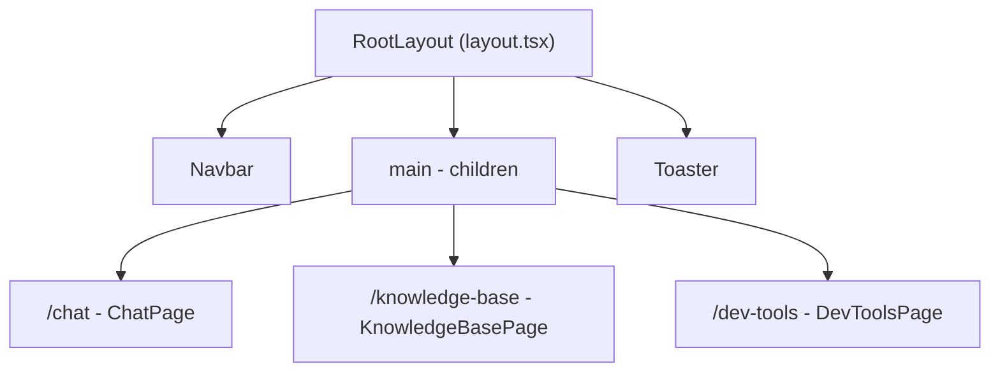
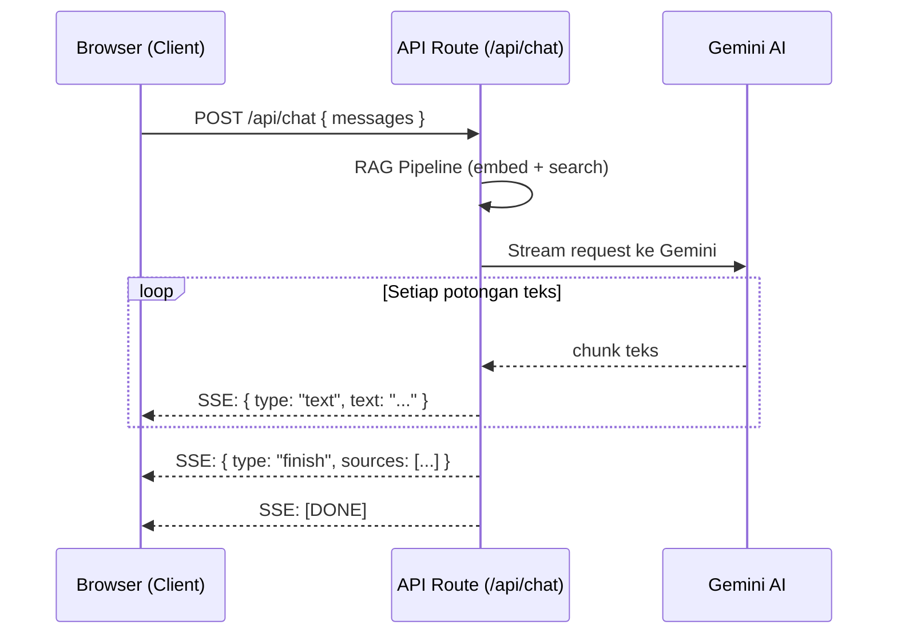
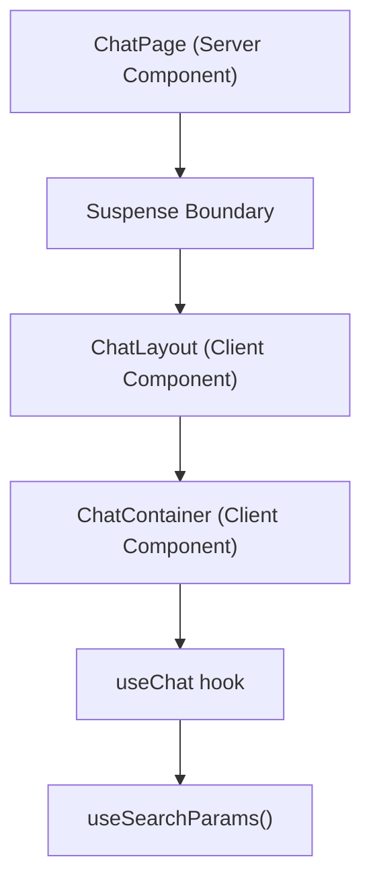

# Essential Next.js Concepts

> Dokumen ini menjelaskan konsep-konsep Next.js yang dipakai di project **Janasku** (RAG Chatbot).
> Ditulis untuk fresh graduate yang baru bergabung di tim engineering.

---

## Daftar Isi

1. [App Router](#1-app-router--folder--route)
2. [Layout](#2-layout--kerangka-halaman)
3. [Server Components vs Client Components](#3-server-components-vs-client-components)
4. [Server Actions ("use server")](#4-server-actions-use-server)
5. [API Routes](#5-api-routes)
6. [useRouter & useSearchParams](#6-userouter--usesearchparams)
7. [redirect()](#7-redirect)
8. [Import Alias](#8-import-alias)
9. [Suspense Boundary](#9-suspense-boundary)
10. [Rangkuman](#rangkuman)

---

## 1. App Router — Folder = Route

### Konsep

Di Next.js App Router, **struktur folder di dalam `src/app/` secara otomatis menjadi URL route**. Kamu tidak perlu menulis konfigurasi routing secara manual. Cukup buat folder dan letakkan file `page.tsx` di dalamnya, dan Next.js langsung tahu bahwa itu adalah halaman.

**Analogi**: Bayangkan `src/app/` seperti rak buku di perpustakaan. Setiap rak (folder) punya label (nama folder), dan setiap buku yang bisa dibaca pengunjung adalah file bernama `page.tsx`. Kalau kamu taruh buku di rak "chat", pengunjung bisa langsung buka lewat label `/chat`.

### Struktur di Project Janasku

```
src/app/
  ├── layout.tsx              --> Kerangka semua halaman
  ├── page.tsx                --> Route: /         (root)
  ├── globals.css
  ├── favicon.ico
  ├── chat/
  │   └── page.tsx            --> Route: /chat
  ├── knowledge-base/
  │   └── page.tsx            --> Route: /knowledge-base
  ├── dev-tools/
  │   └── page.tsx            --> Route: /dev-tools
  └── api/
      └── chat/
          └── route.ts        --> API: POST /api/chat
```

### Aturan Penting

| File          | Fungsi                                      |
|---------------|---------------------------------------------|
| `page.tsx`    | Mendefinisikan halaman yang bisa diakses user |
| `layout.tsx`  | Kerangka yang membungkus halaman              |
| `route.ts`    | API endpoint (bukan halaman, tapi backend)    |

Jadi kalau kamu mau bikin halaman baru, misalnya `/settings`, kamu cukup buat folder `src/app/settings/` lalu isi dengan `page.tsx`. Selesai, route langsung aktif.

---

## 2. Layout — Kerangka Halaman

### Konsep

Layout adalah **kerangka yang membungkus semua halaman**. Elemen-elemen yang sama di setiap halaman (misalnya navbar, footer, toast notification) cukup ditulis sekali di layout, dan otomatis tampil di semua halaman anak.

**Analogi**: Layout itu seperti bingkai foto. Semua foto (halaman) yang kamu masukkan ke bingkai ini akan punya border dan hiasan yang sama. Kamu tidak perlu menggambar ulang bingkainya setiap ganti foto.

### Contoh dari Project Janasku

```tsx
// File: src/app/layout.tsx

import type { Metadata } from "next";
import { Geist, Geist_Mono } from "next/font/google";
import { Navbar } from "@/shared/components/navbar";
import { Toaster } from "@/shared/components/ui/sonner";
import "./globals.css";

const geistSans = Geist({
  variable: "--font-geist-sans",
  subsets: ["latin"],
});

const geistMono = Geist_Mono({
  variable: "--font-geist-mono",
  subsets: ["latin"],
});

export const metadata: Metadata = {
  title: "Janasku",
  description: "Chatbot pintar untuk menjawab pertanyaan pelanggan Janasku",
};

export default function RootLayout({
  children,
}: Readonly<{
  children: React.ReactNode;
}>) {
  return (
    <html lang="id">
      <body
        className={`${geistSans.variable} ${geistMono.variable} antialiased`}
      >
        <Navbar />
        <main className="min-h-[calc(100svh-3.5rem)]">{children}</main>
        <Toaster />
      </body>
    </html>
  );
}
```

### Yang Perlu Kamu Perhatikan

- **`<Navbar />`** tampil di semua halaman — ditulis sekali, berlaku di mana-mana.
- **`<Toaster />`** (dari library Sonner) juga global — notifikasi toast bisa dipanggil dari halaman mana saja.
- **`{children}`** adalah placeholder yang akan diisi oleh konten halaman aktif. Ketika user membuka `/chat`, maka `children` berisi konten dari `src/app/chat/page.tsx`.
- **`metadata`** mendefinisikan judul tab browser dan deskripsi untuk SEO.



---

## 3. Server Components vs Client Components

### Konsep

Next.js App Router punya dua jenis komponen:

- **Server Component** (default): Kode dijalankan di server. User tidak pernah menerima JavaScript-nya. Cocok untuk fetch data, akses database, render HTML statis.
- **Client Component** (ditandai `"use client"`): Kode dikirim ke browser dan dijalankan di sana. Dibutuhkan untuk interaktivitas — klik tombol, ketik di input, useState, useEffect, dsb.

**Analogi**: Server Component itu seperti koki di dapur restoran. Dia memasak (memproses data), lalu mengirim piring berisi makanan jadi (HTML) ke meja pelanggan. Pelanggan tidak perlu tahu resepnya. Client Component itu seperti sushi conveyor belt — makanannya sudah di depan kamu, dan kamu sendiri yang mengambil, mencelup ke kecap, berinteraksi langsung.

### Tabel Perbandingan

| Aspek                  | Server Component             | Client Component              |
|------------------------|------------------------------|-------------------------------|
| Ditandai dengan        | Tidak ada direktif (default) | `"use client"` di baris pertama |
| Dijalankan di          | Server                       | Browser (client)              |
| Akses database         | Bisa langsung                | Tidak bisa                    |
| `useState` / `useEffect` | Tidak bisa               | Bisa                          |
| Event handler (onClick)| Tidak bisa                   | Bisa                          |
| Ukuran bundle JS       | 0 KB (tidak dikirim ke browser) | Dikirim ke browser         |
| Contoh use case        | Fetch daftar dokumen         | Form chat, animasi, interaksi |

### Contoh Server Component — Knowledge Base Page

```tsx
// File: src/app/knowledge-base/page.tsx
// Tidak ada "use client" --> ini Server Component

import { getDocuments, DropZone, FileList } from "@/features/knowledge-base";

export default async function KnowledgeBasePage() {
  const documents = await getDocuments();   // <-- fetch data langsung di server!

  return (
    <div className="mx-auto max-w-3xl px-6 py-8">
      <h1 className="text-2xl font-bold">Knowledge Base</h1>
      <p className="mt-1 text-muted-foreground">
        Kelola dokumen yang menjadi sumber pengetahuan chatbot.
      </p>
      <div className="mt-6">
        <DropZone />
      </div>
      <div className="mt-8">
        <FileList documents={documents} />
      </div>
    </div>
  );
}
```

Perhatikan function-nya `async` — ini hanya bisa dilakukan di Server Component. Data sudah di-fetch di server sebelum HTML dikirim ke browser.

### Contoh Client Component — Chat Container

```tsx
// File: src/features/chat/components/chat-container.tsx

"use client";   // <-- Direktif ini menandakan: "Jalankan di browser!"

import { useState, useEffect, useRef } from "react";
import { useChat } from "../hooks/use-chat";
import { WelcomeState } from "./welcome-state";
import { ChatBubble } from "./chat-bubble";
import { ChatInput } from "./chat-input";
// ... import lainnya

export function ChatContainer() {
  const {
    messages,
    sendMessage,
    status,
    error,
    regenerate,
    isLoadingHistory,
    conversationId,
  } = useChat();

  const [input, setInput] = useState("");      // <-- butuh state
  const scrollRef = useRef<HTMLDivElement>(null); // <-- butuh ref

  // ... logika interaksi user
}
```

Komponen ini butuh `useState`, `useEffect`, dan event handler (`handleSubmit`) — semua itu hanya bisa berjalan di browser, makanya perlu `"use client"`.

### Kapan Pakai Masing-Masing?

- **Gunakan Server Component** kalau komponen hanya menampilkan data tanpa interaksi. Contoh: halaman daftar dokumen, halaman statis.
- **Gunakan Client Component** kalau komponen butuh interaktivitas: input form, tombol yang di-klik, animasi, atau React hooks (`useState`, `useEffect`, `useRef`).

---

## 4. Server Actions (`"use server"`)

### Konsep

Server Actions adalah **fungsi yang ditulis di file terpisah dengan direktif `"use server"`, tapi bisa dipanggil langsung dari Client Component**. Next.js otomatis membuat "jembatan" sehingga ketika kamu panggil fungsi tersebut di browser, yang sebenarnya terjadi adalah request ke server.

**Analogi**: Server Action itu seperti nomor layanan delivery di restoran. Kamu (client) cukup telepon (panggil fungsi), bilang pesanan (parameter), dan makanan (data) diantar ke rumahmu. Kamu tidak perlu tahu di mana dapurnya atau bagaimana cara memasak. Yang penting: kamu telepon, hasilnya datang.

### Contoh dari Project Janasku

```tsx
// File: src/features/chat/actions/conversation-actions.ts

"use server";   // <-- Seluruh fungsi di file ini berjalan di server

import { supabase } from "@/shared/lib/supabase";
import type { Conversation, ChatMessage, ChatSource } from "../types";

export async function getConversations(): Promise<Conversation[]> {
  const { data, error } = await supabase
    .from("conversations")
    .select("*")
    .order("updated_at", { ascending: false });

  if (error) {
    throw new Error(`Failed to fetch conversations: ${error.message}`);
  }

  return data;
}

export async function createConversation(
  title: string
): Promise<Conversation> {
  const { data, error } = await supabase
    .from("conversations")
    .insert({ title })
    .select()
    .single();

  if (error) {
    throw new Error(`Failed to create conversation: ${error.message}`);
  }

  return data;
}

export async function deleteConversation(id: string): Promise<void> {
  const { error } = await supabase
    .from("conversations")
    .delete()
    .eq("id", id);

  if (error) {
    throw new Error(`Failed to delete conversation: ${error.message}`);
  }
}
```

### Bagaimana Client Component Memanggilnya?

Di `use-chat.ts` (Client Component), fungsi-fungsi server action ini di-import dan dipanggil langsung seperti fungsi biasa:

```tsx
// File: src/features/chat/hooks/use-chat.ts

"use client";

import {
  getMessages,
  createConversation,
  saveMessage,
} from "../actions/conversation-actions";   // <-- import Server Action

export function useChat() {
  // ...
  const sendMessage = useCallback(async (text: string) => {
    // ...
    if (!convId) {
      const conversation = await createConversation(title);  // <-- panggil!
      convId = conversation.id;
    }
    await saveMessage(convId, "user", text);  // <-- panggil lagi!
    // ...
  }, [/* ... */]);
}
```

Meskipun `createConversation` dan `saveMessage` mengakses database (Supabase), kamu bisa panggil mereka dari kode browser. Next.js yang mengurus pengiriman request ke server secara otomatis.

### Contoh Server Action Lain: Document Actions

```tsx
// File: src/features/knowledge-base/actions/document-actions.ts

"use server";

import { revalidatePath } from "next/cache";
import { supabase } from "@/shared/lib/supabase";

export async function uploadDocument(
  formData: FormData
): Promise<{ error: string | null; documentId?: string }> {
  const file = formData.get("file") as File;

  if (!file) {
    return { error: "File is required" };
  }

  // ... validasi dan upload ke Supabase Storage ...

  revalidatePath("/knowledge-base");    // <-- refresh cache halaman
  return { error: null, documentId: data.id };
}

export async function deleteDocument(
  id: string
): Promise<{ error: string | null }> {
  // ... hapus dari storage dan database ...

  revalidatePath("/knowledge-base");    // <-- refresh cache halaman
  return { error: null };
}
```

Perhatikan penggunaan `revalidatePath("/knowledge-base")` — ini memberi tahu Next.js untuk me-refresh data di halaman `/knowledge-base` setelah ada perubahan. Fitur ini hanya tersedia di server.

---

## 5. API Routes

### Konsep

API Route adalah cara membuat **backend endpoint** langsung di dalam project Next.js. File `route.ts` di dalam folder `src/app/api/` akan menjadi endpoint yang bisa diakses via HTTP (GET, POST, PUT, DELETE, dsb.).

**Analogi**: Kalau Server Action itu seperti telepon delivery, API Route itu seperti **loket pelayanan** di kantor pemerintah. Kamu datang (kirim request), ambil nomor antrian, dan tunggu hasilnya. Bedanya dengan Server Action: di API Route kamu punya kontrol penuh atas request dan response HTTP, termasuk **streaming**.

### Kenapa Chat Pakai API Route, Bukan Server Action?

**Jawaban singkat: Streaming.**

Server Action mengembalikan data setelah seluruh proses selesai (seperti memesan makanan dan menunggu semuanya matang). Tapi untuk chatbot, kita mau jawaban muncul **kata per kata** secara real-time (seperti menonton koki memasak di depan kamu). Ini disebut **streaming response** — dan hanya bisa dilakukan lewat API Route dengan `ReadableStream`.

### Contoh dari Project Janasku

```tsx
// File: src/app/api/chat/route.ts

import { streamChat } from "@/shared/lib/gemini";
import { embedQuery } from "@/features/chat/lib/embeddings";
import { searchDocuments } from "@/features/chat/lib/vector-search";
import { buildRagContext } from "@/features/chat/lib/rag-context";
import { getSystemPrompt } from "@/features/chat/lib/system-prompt";

export async function POST(req: Request) {
  const { messages } = await req.json();

  // RAG Pipeline: embed query -> cari dokumen relevan -> bangun konteks
  const lastUserMessage = messages
    .filter((m: { role: string }) => m.role === "user")
    .pop();

  const queryText = lastUserMessage.text ?? lastUserMessage.content ?? "";
  const queryEmbedding = await embedQuery(queryText);
  const searchResults = await searchDocuments(queryEmbedding);
  const { contextText, sources, hasRelevantContext } = buildRagContext(searchResults);
  const systemPrompt = getSystemPrompt(contextText, hasRelevantContext);

  // Stream dari Gemini AI
  const textStream = streamChat(geminiMessages, systemPrompt);
  const reader = textStream.getReader();

  // Bangun SSE (Server-Sent Events) response
  const sseStream = new ReadableStream({
    async start(controller) {
      const encoder = new TextEncoder();
      try {
        while (true) {
          const { done, value } = await reader.read();
          if (done) break;
          controller.enqueue(
            encoder.encode(
              `data: ${JSON.stringify({ type: "text", text: value })}\n\n`
            )
          );
        }
        // Kirim sumber referensi setelah stream selesai
        controller.enqueue(
          encoder.encode(
            `data: ${JSON.stringify({ type: "finish", sources })}\n\n`
          )
        );
      } finally {
        controller.close();
      }
    },
  });

  return new Response(sseStream, {
    headers: {
      "Content-Type": "text/event-stream",   // <-- tipe streaming
      "Cache-Control": "no-cache",
      Connection: "keep-alive",
    },
  });
}
```

### Alur Streaming Chat



### Perbandingan: Server Action vs API Route

| Aspek              | Server Action           | API Route               |
|--------------------|-------------------------|-------------------------|
| Bisa streaming?    | Tidak                   | Bisa                    |
| Kontrol HTTP?      | Terbatas                | Penuh (headers, status) |
| Cara panggil       | Import & panggil fungsi | `fetch("/api/...")`     |
| Cocok untuk        | CRUD data sederhana     | Streaming, webhook, dsb |

---

## 6. `useRouter` & `useSearchParams`

### Konsep

Dua hooks ini dari `next/navigation` digunakan untuk **navigasi dan membaca URL** di Client Component.

- **`useRouter()`** — untuk berpindah halaman secara programmatic (tanpa klik link).
- **`useSearchParams()`** — untuk membaca query parameter dari URL, misalnya `?c=abc123`.

**Analogi**: `useRouter` itu seperti supir taksi — kamu bilang mau ke mana, dia yang bawa. `useSearchParams` itu seperti membaca label di koper — kamu bisa tahu informasi apa yang "dibawa" oleh URL saat ini.

### Contoh dari Project Janasku

Di project ini, setiap conversation punya ID yang disimpan di URL sebagai query parameter `?c=<id>`. Misalnya: `/chat?c=550e8400-e29b-41d4-a716-446655440000`.

```tsx
// File: src/features/chat/hooks/use-chat.ts

"use client";

import { useSearchParams, useRouter } from "next/navigation";

export function useChat() {
  const searchParams = useSearchParams();
  const router = useRouter();
  const conversationId = searchParams.get("c");  // <-- baca ?c=... dari URL

  // ...

  const sendMessage = useCallback(async (text: string) => {
    let convId = conversationIdRef.current;

    if (!convId) {
      // Buat conversation baru
      const conversation = await createConversation(title);
      convId = conversation.id;
      // ...
    }

    // Update URL setelah conversation baru dibuat
    if (isNew) {
      router.replace(`/chat?c=${convId}`);   // <-- navigasi ke URL baru
    }
  }, [/* ... */]);

  // ...
}
```

### Penjelasan Alur

1. User buka `/chat` (tanpa query parameter) -- `conversationId` bernilai `null`.
2. User mengirim pesan pertama -- conversation baru dibuat di database.
3. `router.replace(`/chat?c=${convId}`)` dipanggil -- URL berubah menjadi `/chat?c=abc123` **tanpa menambah entry di browser history** (karena `replace`, bukan `push`).
4. Kalau user klik conversation lain di sidebar, URL berubah lagi -- `useSearchParams` membaca ID baru, dan pesan-pesan lama dimuat.

> **`router.replace` vs `router.push`**: `replace` mengganti URL tanpa menambah history (tombol Back tidak kembali ke URL sebelumnya). `push` menambah entry baru di history. Di project ini `replace` dipakai agar user tidak bisa "back" ke conversation kosong.

---

## 7. `redirect()`

### Konsep

`redirect()` dari `next/navigation` digunakan di **Server Component** untuk langsung mengarahkan user ke halaman lain. Ini terjadi di server sebelum HTML dikirim ke browser — jadi user tidak pernah melihat halaman asal.

**Analogi**: Kamu pergi ke resepsionis hotel dan tanya "Di mana restoran?". Resepsionis langsung mengantar kamu ke restoran, tanpa kamu sempat masuk ke lobby. Itulah `redirect` — kamu tidak pernah melihat halaman aslinya.

### Contoh dari Project Janasku

```tsx
// File: src/app/page.tsx

import { redirect } from "next/navigation";

export default function Home() {
  redirect("/chat");
}
```

Penjelasan: Ketika user mengakses root URL (`/`), mereka langsung diarahkan ke `/chat`. Halaman root ini tidak menampilkan apa-apa — fungsinya murni sebagai pengalih.

**Kapan pakai `redirect()`?**
- Ketika sebuah halaman tidak punya konten sendiri dan harus langsung pindah ke halaman lain.
- Ketika user belum login dan harus diarahkan ke halaman login.
- Ketika URL lama sudah deprecated dan harus mengarah ke URL baru.

---

## 8. Import Alias

### Konsep

Import alias memungkinkan kamu menulis path import yang lebih pendek dan konsisten. Di project ini, **`@/` adalah alias untuk `src/`**. Jadi daripada menulis relative path yang panjang dan membingungkan, kamu bisa pakai alias yang selalu jelas.

**Analogi**: Daripada bilang "Ambilkan buku di rak ketiga, baris kedua dari bawah, kolom keenam dari kiri" (relative path), kamu cukup bilang "Ambilkan buku dengan kode RAK-3-2-6" (alias). Lebih singkat, tidak ambigu, dan tidak tergantung posisi kamu berdiri.

### Konfigurasi di `tsconfig.json`

```json
// File: tsconfig.json

{
  "compilerOptions": {
    "paths": {
      "@/*": ["./src/*"]
    }
  }
}
```

### Perbandingan

```tsx
// Tanpa alias (relative path) -- membingungkan, tergantung lokasi file
import { supabase } from "../../../shared/lib/supabase";
import { Navbar } from "../../shared/components/navbar";

// Dengan alias -- selalu konsisten, dari mana pun file berada
import { supabase } from "@/shared/lib/supabase";
import { Navbar } from "@/shared/components/navbar";
```

Contoh nyata dari `src/app/layout.tsx`:

```tsx
import { Navbar } from "@/shared/components/navbar";
import { Toaster } from "@/shared/components/ui/sonner";
```

Dan dari `src/features/chat/actions/conversation-actions.ts`:

```tsx
import { supabase } from "@/shared/lib/supabase";
```

Selalu gunakan `@/` di project ini. Hindari relative path kecuali untuk import file di folder yang sama (misalnya `./welcome-state`).

---

## 9. Suspense Boundary

### Konsep

`<Suspense>` adalah fitur React yang memungkinkan kamu menampilkan **fallback (loading state)** sementara komponen anak sedang memuat data atau menunggu sesuatu. Di Next.js App Router, Suspense sangat penting ketika kamu menggunakan Client Component yang membaca `useSearchParams()`.

**Analogi**: Suspense itu seperti layar "Mohon Tunggu" di bioskop sebelum film dimulai. Penonton (user) tidak melihat layar kosong — mereka tahu ada sesuatu yang sedang disiapkan.

### Kenapa Dibutuhkan?

Komponen yang menggunakan `useSearchParams()` butuh dibungkus `<Suspense>` karena Next.js perlu waktu untuk membaca query parameter di URL. Tanpa Suspense, Next.js akan memberikan error saat build.

### Contoh dari Project Janasku

```tsx
// File: src/app/chat/page.tsx

import { Suspense } from "react";
import { ChatLayout } from "@/features/chat";

export default function ChatPage() {
  return (
    <Suspense>
      <ChatLayout />
    </Suspense>
  );
}
```

`ChatLayout` mengandung `ChatContainer`, yang menggunakan `useChat()`, yang di dalamnya memanggil `useSearchParams()`. Rantai ini mengharuskan pembungkusan dengan `<Suspense>`.



Kamu juga bisa menambahkan `fallback` prop untuk menampilkan loading indicator:

```tsx
<Suspense fallback={<div>Memuat...</div>}>
  <ChatLayout />
</Suspense>
```

---

## Rangkuman

| Konsep               | Fungsi Utama                                         | File Contoh di Project                            |
|----------------------|------------------------------------------------------|---------------------------------------------------|
| App Router           | Folder = route, otomatis                             | `src/app/chat/page.tsx`                           |
| Layout               | Kerangka halaman bersama (navbar, toast)              | `src/app/layout.tsx`                              |
| Server Component     | Render di server, bisa async fetch data               | `src/app/knowledge-base/page.tsx`                 |
| Client Component     | Render di browser, interaktif (hooks, event)          | `src/features/chat/components/chat-container.tsx` |
| Server Actions       | Fungsi server yang bisa dipanggil dari client          | `src/features/chat/actions/conversation-actions.ts` |
| API Routes           | Backend endpoint, mendukung streaming                  | `src/app/api/chat/route.ts`                       |
| useRouter            | Navigasi programmatic dari client                     | `src/features/chat/hooks/use-chat.ts`             |
| useSearchParams      | Baca query parameter URL (?c=...)                     | `src/features/chat/hooks/use-chat.ts`             |
| redirect()           | Arahkan user ke halaman lain dari server              | `src/app/page.tsx`                                |
| Import Alias (@/)    | Shortcut path: `@/` = `src/`                         | `tsconfig.json`                                   |
| Suspense Boundary    | Bungkus komponen yang butuh loading state              | `src/app/chat/page.tsx`                           |

---

**Sebelumnya**: `essential_of_this_repository.md`

**Selanjutnya**: `essential_supabase_concepts.md` untuk memahami database dan Supabase yang dipakai project ini.
