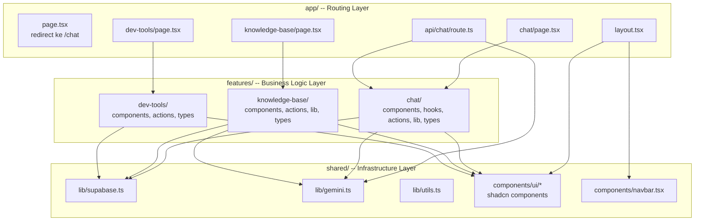

# Essential of This Repository

> Panduan pertama untuk mengenal codebase Janasku -- bacalah ini sebelum menyentuh kode apa pun.

---

## 1. Apa itu Janasku?

Bayangkan kamu punya toko jamu online. Setiap hari ada puluhan pelanggan bertanya: "Apa manfaat kunyit?", "Produk mana yang cocok untuk daya tahan tubuh?", "Berapa harga paket herbal?" -- dan tim CS-mu kewalahan.

**Janasku** adalah _RAG chatbot_ yang menyelesaikan masalah itu. Alih-alih menjawab manual, kamu cukup mengunggah dokumen produk (PDF/TXT) ke _knowledge base_, lalu chatbot otomatis menjawab pertanyaan pelanggan berdasarkan dokumen tersebut.

Bagaimana cara kerjanya secara singkat?

1. Admin upload dokumen produk ke **Knowledge Base**
2. Dokumen dipecah menjadi potongan kecil (_chunks_), lalu diubah menjadi angka-angka (_embedding_) dan disimpan di database
3. Saat pelanggan bertanya, pertanyaan juga diubah jadi embedding, lalu dicari potongan dokumen yang paling mirip (_vector search_)
4. Potongan yang relevan dikirim ke AI (Gemini) sebagai konteks, dan AI menjawab berdasarkan konteks itu
5. Jawaban di-_stream_ secara real-time ke browser pelanggan

Analoginya: bayangkan kamu punya pustakawan super cerdas. Saat ada pertanyaan, ia langsung mencari buku yang relevan di rak, membaca bagian yang tepat, lalu menjawab dengan bahasanya sendiri -- itulah RAG.

---

## 2. Tech Stack

| Teknologi | Peran | Analogi Dunia Nyata |
|---|---|---|
| **Next.js 16** | Framework fullstack (frontend + backend) | Gedung kantor -- satu bangunan untuk semua departemen |
| **React 19** | Library UI untuk membangun antarmuka | Lego blocks -- komponen kecil yang disusun jadi halaman |
| **TypeScript** | JavaScript dengan tipe data | Rambu lalu lintas -- mencegah "kecelakaan" saat coding |
| **Supabase** | Backend-as-a-Service (database, storage, auth) | Gudang serba ada -- penyimpanan data, file, semuanya |
| **pgvector** | Ekstensi PostgreSQL untuk vector search | Indeks buku khusus yang bisa mencari berdasarkan "kemiripan makna" |
| **Gemini API** | AI untuk chat dan embedding | Otak chatbot -- yang benar-benar "berpikir" dan menjawab |
| **Tailwind CSS** | Utility-first CSS framework | Stiker dekorasi -- tempel langsung ke elemen HTML |
| **shadcn/ui** | Komponen UI yang sudah jadi (Button, Dialog, dll) | Furnitur IKEA -- tinggal rakit, desainnya sudah bagus |
| **pdf-parse** | Ekstraksi teks dari file PDF | Mesin fotokopi yang bisa "membaca" isi PDF jadi teks biasa |
| **react-markdown** | Render teks Markdown jadi HTML | Penerjemah -- mengubah format `**bold**` jadi tampilan **tebal** |

---

## 3. Arsitektur 3-Layer

Codebase ini mengikuti pola arsitektur 3-layer yang ketat. Bayangkan seperti struktur organisasi perusahaan:

- **`app/`** = Resepsionis -- menerima request dan mengarahkan ke departemen yang tepat
- **`features/`** = Departemen -- setiap departemen punya keahlian spesifik (chat, knowledge-base, dev-tools)
- **`shared/`** = Gudang kantor -- peralatan dan utilitas yang dipakai semua departemen



---

## 4. Aturan Dependency (Import Rules)

Ini adalah aturan paling penting yang **tidak boleh dilanggar**:

| Aturan | Penjelasan | Contoh |
|---|---|---|
| `app/` boleh import `features/` | Halaman memanggil fitur | `import { ChatLayout } from "@/features/chat"` |
| `app/` boleh import `shared/` | Halaman pakai komponen umum | `import { Navbar } from "@/shared/components/navbar"` |
| `features/` boleh import `shared/` | Fitur pakai utilitas bersama | `import { supabase } from "@/shared/lib/supabase"` |
| `features/` **DILARANG** import `features/` lain | Tidak boleh lintas fitur! | `import { X } from "@/features/chat"` di dalam `features/knowledge-base` |
| `shared/` **DILARANG** import `features/` atau `app/` | Shared tidak boleh tahu soal fitur | - |

Analoginya: departemen HR tidak boleh langsung mengambil dokumen dari departemen Finance. Kalau butuh data yang sama, ambil dari gudang kantor (`shared/`).

**Kenapa aturan ini penting?**

- Mencegah _circular dependency_ (A butuh B, B butuh A -- deadlock!)
- Setiap fitur bisa dikembangkan secara independen
- Kalau satu fitur dihapus, fitur lain tidak rusak

Perhatikan bagaimana halaman `chat/page.tsx` mengimpor dari feature module-nya:

```tsx
// src/app/chat/page.tsx
import { ChatLayout } from "@/features/chat";  // import dari barrel file (index.ts)
```

Dan feature module itu mengekspor hanya apa yang dibutuhkan lewat `index.ts`:

```ts
// src/features/chat/index.ts
export { ChatContainer } from "./components/chat-container";
export { ChatLayout } from "./components/chat-layout";
export type { ChatSource } from "./types";
```

File `index.ts` ini disebut **barrel file** -- ia bertindak sebagai "pintu resmi" feature module. Dunia luar hanya bisa mengakses apa yang diekspor di sini.

---

## 5. Anatomi Feature Module

Setiap feature module mengikuti struktur yang konsisten. Mari kita bedah `features/chat/` sebagai contoh:

```
src/features/chat/
  components/         -- Komponen React khusus fitur ini
    chat-layout.tsx       UI layout utama (sidebar + chat area)
    chat-container.tsx    Container pesan dan input
    chat-bubble.tsx       Bubble pesan user/assistant
    chat-input.tsx        Form input pesan
    chat-sidebar.tsx      Sidebar daftar percakapan
    source-block.tsx      Blok sumber referensi dokumen
    welcome-state.tsx     Tampilan saat belum ada pesan
    typing-indicator.tsx  Indikator "sedang mengetik..."
    error-message.tsx     Tampilan error
    rename-dialog.tsx     Dialog rename percakapan
    delete-confirm-dialog.tsx  Konfirmasi hapus percakapan
  hooks/              -- Custom React hooks
    use-chat.ts           Hook utama: kirim pesan, streaming, state management
  actions/            -- Server Actions (fungsi server yang dipanggil dari client)
    conversation-actions.ts   CRUD percakapan dan pesan di Supabase
  lib/                -- Logic murni (non-React), utility functions
    vector-search.ts      Pencarian dokumen mirip (vector similarity)
    embeddings.ts         Konversi teks jadi embedding
    rag-context.ts        Bangun konteks dari hasil search
    system-prompt.ts      System prompt untuk Gemini
  types.ts            -- Type definitions (ChatMessage, Conversation, dll)
  index.ts            -- Barrel file: pintu ekspor resmi
```

**Pola ini berlaku di semua feature module:**

| Folder/File | Isi | Analogi |
|---|---|---|
| `components/` | Komponen React (UI) | Tampilan toko -- apa yang dilihat pelanggan |
| `hooks/` | Custom hooks (state + logic di client) | Kasir -- mengelola alur transaksi |
| `actions/` | Server Actions (operasi server) | Gudang belakang -- proses di balik layar |
| `lib/` | Pure functions, utilities | Alat-alat kerja -- kalkulator, timbangan |
| `types.ts` | TypeScript type definitions | Formulir standar -- format data yang disepakati |
| `index.ts` | Barrel file (public API) | Pintu depan toko -- hanya ini yang bisa diakses orang luar |

Untuk membandingkan, lihat juga struktur `features/knowledge-base/`:

```
src/features/knowledge-base/
  components/
    drop-zone.tsx         Area drag-and-drop upload file
    file-list.tsx         Daftar dokumen yang sudah diunggah
    file-item.tsx         Satu baris item dokumen
    delete-dialog.tsx     Konfirmasi hapus dokumen
  actions/
    document-actions.ts   Upload, list, delete dokumen (Server Actions)
  lib/
    process-document.ts   Pipeline ingestion: extract, chunk, embed, save
    pdf-extractor.ts      Ekstraksi teks dari PDF
    chunker.ts            Pecah teks panjang jadi chunks
  types.ts
  index.ts
```

Perhatikan polanya sama: `components/`, `actions/`, `lib/`, `types.ts`, `index.ts`. Tidak semua feature butuh `hooks/` -- itu opsional tergantung kebutuhan.

---

## 6. File Penting yang Harus Kamu Kenal

Ini adalah file-file kunci yang perlu kamu baca pertama kali. Urutannya dari yang paling fundamental:

| # | File Path | Fungsi | Prioritas |
|---|---|---|---|
| 1 | `src/shared/lib/supabase.ts` | Inisialisasi koneksi Supabase (database + storage) | Wajib |
| 2 | `src/shared/lib/gemini.ts` | Client Gemini API: embedding + chat streaming | Wajib |
| 3 | `src/app/api/chat/route.ts` | API Route: orkestrasi seluruh pipeline RAG | Wajib |
| 4 | `src/features/chat/hooks/use-chat.ts` | Hook utama: kirim pesan, streaming SSE, state | Wajib |
| 5 | `src/features/chat/lib/vector-search.ts` | Vector similarity search via Supabase RPC | Wajib |
| 6 | `src/features/chat/lib/rag-context.ts` | Menyusun konteks dari hasil pencarian | Wajib |
| 7 | `src/features/chat/lib/system-prompt.ts` | System prompt yang mengarahkan perilaku AI | Wajib |
| 8 | `src/features/knowledge-base/lib/process-document.ts` | Pipeline ingestion: upload, extract, chunk, embed, save | Wajib |
| 9 | `src/features/knowledge-base/lib/chunker.ts` | Memecah teks panjang menjadi chunks | Penting |
| 10 | `src/features/knowledge-base/actions/document-actions.ts` | Server Actions untuk upload, list, delete dokumen | Penting |
| 11 | `src/features/chat/actions/conversation-actions.ts` | Server Actions untuk CRUD percakapan dan pesan | Penting |
| 12 | `src/app/layout.tsx` | Root layout: font, navbar, metadata | Penting |

**Tips membaca**: Mulai dari file #1 dan #2 (infrastruktur), lalu #8 dan #9 (bagaimana dokumen masuk ke sistem), baru #3 sampai #7 (bagaimana pertanyaan dijawab). Ini mengikuti alur data natural dari _ingestion_ ke _retrieval_.

---

## 7. Environment Variables

Aplikasi ini membutuhkan 3 environment variable yang didefinisikan di file `.env.local`. Referensi dari `.env.example`:

```bash
# .env.example
SUPABASE_URL=
SUPABASE_SERVICE_ROLE_KEY=
GOOGLE_GENERATIVE_AI_API_KEY=
```

| Variable | Dari Mana | Untuk Apa | Dipakai Di |
|---|---|---|---|
| `SUPABASE_URL` | Dashboard Supabase > Project Settings > API | URL project Supabase kamu | `src/shared/lib/supabase.ts` |
| `SUPABASE_SERVICE_ROLE_KEY` | Dashboard Supabase > Project Settings > API | Key dengan full access ke database (server-side only!) | `src/shared/lib/supabase.ts` |
| `GOOGLE_GENERATIVE_AI_API_KEY` | Google AI Studio (aistudio.google.com) | API key untuk akses Gemini (embedding + chat) | `src/shared/lib/gemini.ts` |

Begini cara env vars itu dipakai di kode:

```ts
// src/shared/lib/supabase.ts
const supabaseUrl = process.env.SUPABASE_URL;
const supabaseKey = process.env.SUPABASE_SERVICE_ROLE_KEY;

if (!supabaseUrl || !supabaseKey) {
  throw new Error(
    "Missing SUPABASE_URL or SUPABASE_SERVICE_ROLE_KEY environment variables"
  );
}

export const supabase = createClient(supabaseUrl, supabaseKey);
```

```ts
// src/shared/lib/gemini.ts
const API_KEY = process.env.GOOGLE_GENERATIVE_AI_API_KEY!;
```

**Peringatan penting:**
- `SUPABASE_SERVICE_ROLE_KEY` adalah key dengan akses penuh -- **jangan pernah** ekspos ke browser/client. Di project ini ia hanya digunakan di server-side code (Server Actions dan API Routes).
- Jangan commit file `.env.local` ke Git. File ini sudah di-ignore oleh `.gitignore`.

---

## 8. Glossary Istilah

Kamu akan sering menemukan istilah-istilah ini di codebase. Pahami sebelum mulai coding:

| Istilah | Penjelasan | Analogi |
|---|---|---|
| **RAG** | _Retrieval-Augmented Generation_ -- teknik di mana AI mencari dokumen relevan dulu, baru menjawab berdasarkan dokumen itu | Pustakawan yang baca buku dulu sebelum menjawab pertanyaanmu |
| **Embedding** | Representasi teks dalam bentuk array angka (vektor) sehingga mesin bisa menghitung "kemiripan makna" | Menerjemahkan kata-kata ke koordinat di peta -- kata mirip letaknya berdekatan |
| **Vector Search** | Pencarian berdasarkan kemiripan vektor, bukan kecocokan kata persis | Mencari lagu yang _mirip_ nadanya, bukan yang judulnya sama persis |
| **Similarity** | Skor 0-1 yang menunjukkan seberapa mirip dua vektor (0 = tidak mirip, 1 = identik) | Rating bintang kemiripan -- makin tinggi makin cocok |
| **Chunk** | Potongan kecil dari dokumen panjang (di project ini: 1000 karakter dengan 200 overlap) | Memotong koran jadi kliping-kliping kecil per topik |
| **Ingestion** | Proses memasukkan dokumen ke sistem: upload, extract teks, chunk, embed, simpan | Proses katalogisasi buku baru di perpustakaan |
| **SSE** | _Server-Sent Events_ -- protokol di mana server mengirim data ke client secara streaming (satu arah) | Radio -- server siaran, browser mendengarkan |
| **BaaS** | _Backend-as-a-Service_ -- layanan backend siap pakai (Supabase = database + storage + auth tanpa kelola server sendiri) | Kost-kostan -- tinggal pakai, tidak perlu bangun rumah dari nol |
| **pgvector** | Ekstensi PostgreSQL yang menambah kemampuan menyimpan dan mencari vektor | Rak buku khusus di perpustakaan yang bisa mengurutkan buku berdasarkan kemiripan isi |
| **Server Action** | Fungsi server di Next.js yang bisa dipanggil langsung dari komponen React (ditandai `"use server"`) | Menelepon langsung ke gudang tanpa harus lewat resepsionis API |
| **API Route** | Endpoint HTTP di Next.js (file `route.ts` di folder `app/api/`) | Pintu resmi API -- semua permintaan masuk lewat sini |
| **Barrel File** | File `index.ts` yang mengekspor ulang modul-modul internal agar import dari luar lebih rapi | Daftar menu restoran -- kamu tidak perlu tahu isi dapur, cukup pilih dari menu |
| **Stream** | Mengirim data secara bertahap (bukan sekaligus) -- di project ini dipakai agar jawaban chatbot muncul kata per kata | Air mengalir dari keran -- tidak menunggu ember penuh baru dikirim |

---

## Rangkuman

Berikut poin-poin utama yang sudah kita bahas:

1. **Janasku** adalah RAG chatbot yang menjawab pertanyaan pelanggan berdasarkan dokumen yang diunggah ke knowledge base
2. **Tech stack** utama: Next.js 16 + Supabase + Gemini API + pgvector
3. **Arsitektur 3-layer**: `app/` (routing) --> `features/` (business logic) --> `shared/` (infrastruktur)
4. **Dependency flow satu arah**: app --> features --> shared, dan **tidak boleh** lintas feature
5. Setiap **feature module** punya struktur konsisten: `components/`, `hooks/`, `actions/`, `lib/`, `types.ts`, `index.ts`
6. **3 env vars** yang dibutuhkan: `SUPABASE_URL`, `SUPABASE_SERVICE_ROLE_KEY`, `GOOGLE_GENERATIVE_AI_API_KEY`
7. Istilah kunci yang wajib dipahami: RAG, embedding, vector search, chunk, ingestion, SSE, Server Action

---

Selanjutnya, baca `essential_nextjs_concept.md` untuk memahami konsep-konsep Next.js yang dipakai di project ini.
