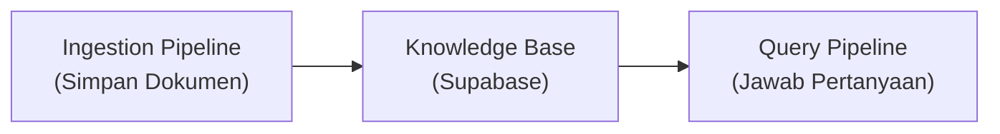
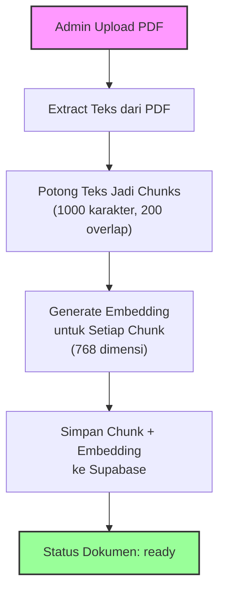
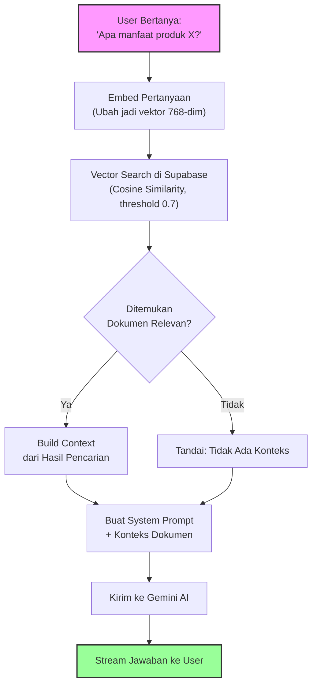

# Sistem RAG (Retrieval-Augmented Generation) di Janasku

## Daftar Isi

- [Apa itu RAG?](#apa-itu-rag)
- [Tahap 1 -- Ingestion Pipeline](#tahap-1--ingestion-pipeline)
- [Tahap 2 -- Query Pipeline](#tahap-2--query-pipeline)
- [Embedding -- Mengubah Teks Jadi Angka](#embedding--mengubah-teks-jadi-angka)
- [Vector Search -- Mencari Kemiripan Makna](#vector-search--mencari-kemiripan-makna)
- [3 Skenario System Prompt](#3-skenario-system-prompt)
- [Kenapa RAG, Bukan Fine-tuning?](#kenapa-rag-bukan-fine-tuning)
- [Chunking Strategy -- Memotong Teks dengan Cerdas](#chunking-strategy--memotong-teks-dengan-cerdas)
- [Rangkuman](#rangkuman)

---

## Apa itu RAG?

### Analogi: Ujian Open-Book vs Closed-Book

Bayangkan kamu sedang ujian:

| Skenario | Analogi | Penjelasan |
|---|---|---|
| **Closed-Book** (tanpa RAG) | Ujian tanpa boleh buka catatan | AI hanya mengandalkan apa yang "dihafalkan" saat training. Kalau ditanya soal produk Janasku, dia tidak tahu karena tidak pernah belajar tentang itu. |
| **Open-Book** (dengan RAG) | Ujian boleh buka catatan | AI boleh "membuka buku" dulu sebelum menjawab. Buku catatan itu adalah **Knowledge Base** kita -- kumpulan dokumen produk yang sudah di-upload. |

**RAG (Retrieval-Augmented Generation)** adalah teknik di mana kita:
1. **Retrieve** -- Cari dulu dokumen yang relevan dengan pertanyaan user
2. **Augment** -- Sisipkan dokumen tersebut ke dalam prompt AI sebagai konteks
3. **Generate** -- Biarkan AI menjawab berdasarkan konteks yang diberikan

Hasilnya? AI bisa menjawab pertanyaan spesifik tentang produk Janasku tanpa perlu di-training ulang. Cukup upload dokumen PDF, dan AI langsung bisa menjawab berdasarkan isi dokumen tersebut.

### Dua Tahap Utama RAG

Sistem RAG di Janasku terdiri dari dua pipeline besar:



1. **Ingestion Pipeline** -- Proses menyiapkan dokumen agar bisa dicari. Terjadi saat admin upload PDF.
2. **Query Pipeline** -- Proses mencari dokumen relevan lalu menjawab pertanyaan user. Terjadi setiap kali user bertanya.

Mari kita bahas satu per satu.

---

## Tahap 1 -- Ingestion Pipeline

Ingestion Pipeline adalah proses "menyuapi" Knowledge Base dengan dokumen. Bayangkan kamu menyiapkan contekan untuk ujian: kamu harus tulis ulang catatan dalam format yang mudah dicari.

### Diagram Alur



### Langkah Demi Langkah

Seluruh proses ini ditangani oleh satu fungsi utama di `src/features/knowledge-base/lib/process-document.ts`:

**Langkah 1-3: Setup dan Download File**

```typescript
// src/features/knowledge-base/lib/process-document.ts

// 1. Update status -> "processing"
await supabase
  .from("documents")
  .update({ status: "processing", updated_at: new Date().toISOString() })
  .eq("id", documentId);

// 2. Fetch document metadata
const { data: doc, error: docError } = await supabase
  .from("documents")
  .select("file_path, mime_type, filename")
  .eq("id", documentId)
  .single();

// 3. Download file from Storage
const { data: fileData, error: downloadError } = await supabase.storage
  .from("documents")
  .download(doc.file_path);
```

**Langkah 4: Extract Teks**

```typescript
// src/features/knowledge-base/lib/process-document.ts

const buffer = Buffer.from(await fileData.arrayBuffer());
let text: string;

if (doc.mime_type === "application/pdf") {
  text = await extractTextFromPdf(buffer);
} else if (doc.mime_type === "text/plain") {
  text = buffer.toString("utf-8");
} else {
  throw new Error(`Unsupported mime type: ${doc.mime_type}`);
}
```

Sistem mendukung dua format: **PDF** dan **plain text**. Untuk PDF, kita pakai library `pdf-parse` di `src/features/knowledge-base/lib/pdf-extractor.ts`.

**Langkah 5: Potong Teks Jadi Chunks**

```typescript
// src/features/knowledge-base/lib/process-document.ts

const chunks = splitTextIntoChunks(text);
```

Fungsi `splitTextIntoChunks` berada di `src/features/knowledge-base/lib/chunker.ts` -- kita akan bahas detailnya di bagian [Chunking Strategy](#chunking-strategy--memotong-teks-dengan-cerdas).

**Langkah 6-7: Generate Embedding dan Simpan**

```typescript
// src/features/knowledge-base/lib/process-document.ts

// 6. Generate embeddings for all chunks (batch)
const embeddings = await embedManyTexts(
  chunks.map((chunk) => chunk.content)
);

// 7. Save chunks + embeddings to DB
const chunkRows = chunks.map((chunk, i) => ({
  document_id: documentId,
  content: chunk.content,
  chunk_index: chunk.chunkIndex,
  embedding: JSON.stringify(embeddings[i]),
  metadata: chunk.metadata,
}));

const { error: insertError } = await supabase
  .from("document_chunks")
  .insert(chunkRows);
```

Setiap chunk disimpan bersama embedding-nya ke tabel `document_chunks` di Supabase. Setelah semua selesai, status dokumen di-update ke `"ready"`.

---

## Tahap 2 -- Query Pipeline

Ini adalah proses yang terjadi setiap kali user mengetik pertanyaan di chatbot. Bayangkan ini seperti urutan kerja seorang asisten perpustakaan: dengarkan pertanyaan, cari buku yang relevan, baca bagian yang cocok, lalu jawab.

### Diagram Alur



### Kode Utama (Route Handler)

Seluruh Query Pipeline diorkestrasikan di `src/app/api/chat/route.ts`:

```typescript
// src/app/api/chat/route.ts

// RAG Pipeline
const queryText = lastUserMessage.text ?? lastUserMessage.content ?? "";
const queryEmbedding = await embedQuery(queryText);                          // Step 1: Embed pertanyaan
const searchResults = await searchDocuments(queryEmbedding);                 // Step 2: Vector search
const { contextText, sources, hasRelevantContext } = buildRagContext(searchResults); // Step 3: Build context
const systemPrompt = getSystemPrompt(contextText, hasRelevantContext);       // Step 4: Buat system prompt
```

Perhatikan betapa bersihnya alur ini -- hanya 4 baris kode yang merepresentasikan seluruh pipeline RAG. Setiap langkah didelegasikan ke modul yang bertanggung jawab:

| Langkah | File | Fungsi |
|---|---|---|
| Embed pertanyaan | `src/features/chat/lib/embeddings.ts` | `embedQuery()` |
| Vector search | `src/features/chat/lib/vector-search.ts` | `searchDocuments()` |
| Build context | `src/features/chat/lib/rag-context.ts` | `buildRagContext()` |
| System prompt | `src/features/chat/lib/system-prompt.ts` | `getSystemPrompt()` |

---

## Embedding -- Mengubah Teks Jadi Angka

### Apa itu Embedding?

Bayangkan kamu punya sebuah kalimat: _"Apa manfaat kunyit untuk kesehatan?"_

Komputer tidak mengerti bahasa manusia. Dia mengerti angka. **Embedding** adalah proses mengubah teks menjadi deret angka (vektor) yang menangkap **makna** dari teks tersebut.

```
"Apa manfaat kunyit untuk kesehatan?"
    |
    v
[0.023, -0.156, 0.892, 0.034, ..., -0.445]   <-- 768 angka
```

Kenapa 768 angka? Karena kita menggunakan model **Gemini Embedding** (`gemini-embedding-001`) dengan konfigurasi `outputDimensionality: 768`. Angka 768 berarti setiap teks direpresentasikan dalam ruang 768 dimensi. Semakin mirip makna dua teks, semakin "dekat" posisi vektor mereka di ruang ini.

### Kode Embedding

```typescript
// src/shared/lib/gemini.ts

const EMBEDDING_MODEL = "gemini-embedding-001";

export async function embedText(text: string): Promise<number[]> {
  const res = await fetch(`${BASE_URL}/${EMBEDDING_MODEL}:embedContent`, {
    method: "POST",
    headers: {
      "Content-Type": "application/json",
      "x-goog-api-key": API_KEY,
    },
    body: JSON.stringify({
      content: { parts: [{ text }] },
      outputDimensionality: 768,
    }),
  });

  const data = await res.json();
  return data.embedding.values;
}
```

Kode ini memanggil Gemini Embedding API secara langsung via `fetch` -- tanpa SDK. Input-nya teks biasa, output-nya array berisi 768 angka desimal.

Untuk proses Ingestion (banyak chunk sekaligus), kita pakai `embedManyTexts` yang mem-batch semua chunk:

```typescript
// src/shared/lib/gemini.ts

export async function embedManyTexts(texts: string[]): Promise<number[][]> {
  return Promise.all(texts.map((t) => embedText(t)));
}
```

### Analogi Embedding

Bayangkan embedding seperti **koordinat GPS** untuk teks:
- "kunyit bagus untuk kesehatan" -> GPS: (-6.200, 106.816)
- "manfaat herbal untuk tubuh" -> GPS: (-6.201, 106.817) -- **dekat** karena makna mirip
- "harga laptop terbaru" -> GPS: (35.689, 139.691) -- **jauh** karena makna beda

Vector search pada dasarnya mencari "teks mana di Knowledge Base yang GPS-nya paling dekat dengan pertanyaan user?"

---

## Vector Search -- Mencari Kemiripan Makna

### Cosine Similarity

Setelah pertanyaan user di-embed menjadi vektor, kita perlu mencari chunk dokumen mana yang paling mirip. Metode yang dipakai adalah **cosine similarity** -- mengukur sudut antara dua vektor.

- **Similarity = 1.0** -- Teks identik maknanya
- **Similarity = 0.7** -- Cukup mirip (threshold default kita)
- **Similarity = 0.0** -- Tidak ada hubungan sama sekali

### Fungsi `match_documents` (Supabase RPC)

Vector search dilakukan di sisi database menggunakan fungsi PostgreSQL yang sudah kita buat di Supabase:

```typescript
// src/features/chat/lib/vector-search.ts

export async function searchDocuments(
  queryEmbedding: number[],
  threshold: number = 0.7,
  count: number = 5
): Promise<SearchResult[]> {
  const { data, error } = await supabase.rpc("match_documents", {
    query_embedding: JSON.stringify(queryEmbedding),
    match_threshold: threshold,
    match_count: count,
  });

  if (error) {
    throw new Error(`Vector search failed: ${error.message}`);
  }

  return data ?? [];
}
```

Mari kita bedah parameter-parameternya:

| Parameter | Nilai Default | Penjelasan |
|---|---|---|
| `query_embedding` | -- | Vektor 768-dim dari pertanyaan user |
| `match_threshold` | `0.7` | Hanya ambil chunk dengan similarity >= 0.7 (70% mirip) |
| `match_count` | `5` | Maksimal 5 chunk paling relevan |

**Kenapa threshold 0.7?** Ini sweet spot antara precision dan recall. Terlalu tinggi (0.9) -- hanya exact match yang lolos, padahal user bisa bertanya dengan kata-kata berbeda. Terlalu rendah (0.3) -- terlalu banyak chunk tidak relevan yang ikut masuk.

### Tipe Data Hasil Search

```typescript
// src/features/chat/lib/vector-search.ts

export type SearchResult = {
  id: string;
  document_id: string;
  content: string;        // isi teks chunk
  chunk_index: number;    // urutan chunk dalam dokumen
  metadata: Record<string, unknown>;
  similarity: number;     // skor kemiripan (0.0 - 1.0)
  filename: string;       // nama file sumber
};
```

### Build RAG Context

Setelah dapat hasil search, kita bangun konteks yang akan disisipkan ke prompt AI:

```typescript
// src/features/chat/lib/rag-context.ts

export function buildRagContext(results: SearchResult[]): {
  contextText: string;
  sources: SourceReference[];
  hasRelevantContext: boolean;
} {
  if (results.length === 0) {
    return { contextText: "", sources: [], hasRelevantContext: false };
  }

  const contextParts = results.map((r) => {
    return `[Dokumen: ${r.filename}, Bagian ${r.chunk_index + 1}]\n${r.content}`;
  });

  return {
    contextText: contextParts.join("\n\n---\n\n"),
    sources: Array.from(sourceMap.values()),
    hasRelevantContext: results.length > 0,
  };
}
```

Perhatikan format konteksnya -- setiap chunk diberi label `[Dokumen: namafile, Bagian X]` sehingga AI tahu sumber informasinya. Chunk-chunk dipisahkan dengan `---` agar mudah dibedakan.

---

## 3 Skenario System Prompt

System prompt adalah "instruksi rahasia" yang kita berikan ke AI sebelum dia menjawab. Di Janasku, ada **3 skenario** berbeda tergantung hasil pencarian dokumen.

Semua skenario berbagi base prompt yang sama (di `src/features/chat/lib/system-prompt.ts`):

```typescript
// src/features/chat/lib/system-prompt.ts

const basePrompt = `Kamu adalah Chatbot Janasku, asisten cerdas untuk produk Janasku (produk jamu/herbal).

PERANMU:
- Menjawab pertanyaan pelanggan tentang produk Janasku menggunakan Knowledge Base
- Menjawab pertanyaan umum tentang kesehatan, jamu, herbal, dan topik umum lainnya dari pengetahuan umummu

ATURAN MENJAWAB:
1. **Pertanyaan spesifik produk Janasku + konteks tersedia**: Jawab berdasarkan konteks dokumen.
2. **Pertanyaan umum**: Jawab dengan bebas dari pengetahuan umummu.
3. **Pertanyaan spesifik produk Janasku + TIDAK ada konteks relevan**: Jawab bahwa informasi belum tersedia.
4. Gunakan bahasa Indonesia yang ramah dan mudah dipahami.
5. Jawab secara ringkas tapi lengkap.
6. Jangan mengarang informasi spesifik produk yang tidak ada di konteks.`;
```

### Skenario 1: Konteks Ditemukan (`hasRelevantContext === true`)

Ini skenario ideal. Vector search menemukan chunk yang relevan, jadi AI bisa menjawab berdasarkan dokumen.

```typescript
// src/features/chat/lib/system-prompt.ts

if (hasRelevantContext) {
  return `${basePrompt}\n\nKONTEKS DOKUMEN (ditemukan bagian relevan):\n${context}`;
}
```

AI mendapat konteks dokumen dan bisa menjawab dengan percaya diri berdasarkan data yang ada.

### Skenario 2: Tidak Ada Konteks Relevan (`context` ada tapi `hasRelevantContext === false`)

Vector search tidak menemukan chunk dengan similarity di atas threshold. AI diberitahu bahwa tidak ada dokumen relevan.

```typescript
// src/features/chat/lib/system-prompt.ts

return `${basePrompt}\n\nSTATUS PENCARIAN: Tidak ditemukan dokumen yang relevan di Knowledge Base.
Jawab pertanyaan umum dari pengetahuan umummu. Untuk pertanyaan spesifik produk Janasku yang tidak ditemukan konteksnya, sampaikan bahwa informasi belum tersedia.`;
```

Pada skenario ini AI masih bisa menjawab pertanyaan umum (misal "apa manfaat kunyit?") dari pengetahuan umumnya, tapi untuk pertanyaan spesifik produk Janasku, AI akan jujur bahwa informasinya belum tersedia.

### Skenario 3: Knowledge Base Kosong (`context === ""`)

Belum ada dokumen sama sekali yang di-upload. Ini terjadi saat sistem baru di-setup.

```typescript
// src/features/chat/lib/system-prompt.ts

if (!context) {
  return `${basePrompt}\n\nSTATUS KNOWLEDGE BASE: Tidak ada dokumen di Knowledge Base saat ini. Jawab pertanyaan umum dari pengetahuan umummu. Untuk pertanyaan spesifik produk, informasikan bahwa informasi belum tersedia.`;
}
```

### Tabel Ringkasan 3 Skenario

| Skenario | Kondisi | Perilaku AI |
|---|---|---|
| Konteks ditemukan | `hasRelevantContext === true` | Jawab berdasarkan konteks dokumen |
| Tidak ada konteks relevan | `context !== ""` tapi `hasRelevantContext === false` | Jawab pertanyaan umum, akui keterbatasan untuk pertanyaan produk |
| Knowledge Base kosong | `context === ""` | Jawab pertanyaan umum saja, informasikan KB belum tersedia |

Desain 3 skenario ini penting agar AI tidak pernah "mengarang" informasi produk. Ini prinsip dasar chatbot yang bertanggung jawab -- **lebih baik jujur tidak tahu daripada memberikan informasi salah**.

---

## Kenapa RAG, Bukan Fine-tuning?

Kamu mungkin bertanya: "Kenapa tidak langsung training ulang AI-nya agar tahu soal produk Janasku?"

Itu namanya **fine-tuning**. Mari kita bandingkan:

| Aspek | RAG | Fine-tuning |
|---|---|---|
| **Analogi** | Ujian open-book -- buka catatan saat menjawab | Belajar intensif sebelum ujian -- hafal semua materi |
| **Update data** | Upload dokumen baru, langsung bisa dipakai | Training ulang model, butuh waktu berjam-jam |
| **Biaya** | Murah -- hanya biaya embedding + storage | Mahal -- biaya GPU untuk training model |
| **Akurasi sumber** | Tinggi -- selalu merujuk ke dokumen terbaru | Bisa outdated jika data training sudah lama |
| **Transparansi** | Bisa tunjukkan sumber (file + bagian mana) | Tidak bisa trace dari mana AI dapat info |
| **Kompleksitas** | Relatif simpel -- API call + database | Kompleks -- butuh dataset, training pipeline, evaluasi |
| **Cocok untuk** | Data yang sering berubah (produk, katalog, FAQ) | Mengubah "gaya" atau "kemampuan" AI secara fundamental |
| **Setup time** | Menit -- upload PDF, langsung jalan | Hari/minggu -- siapkan data, training, evaluasi |

**Untuk kasus Janasku, RAG jelas lebih cocok** karena:
1. Data produk bisa berubah kapan saja (harga, komposisi, produk baru)
2. Admin non-teknis harus bisa update Knowledge Base (cukup upload PDF)
3. Kita perlu transparansi -- user bisa tahu dari dokumen mana info didapat
4. Budget terbatas -- tidak perlu biaya training model

---

## Chunking Strategy -- Memotong Teks dengan Cerdas

### Kenapa Perlu Chunking?

Bayangkan kamu punya buku 200 halaman tentang produk Janasku. Kalau kamu masukkan seluruh buku ke dalam satu embedding, informasinya jadi "terlalu umum" -- vektor-nya tidak spesifik untuk topik apapun.

**Analogi**: Bayangkan kamu bikin index buku. Kamu tidak menulis "Halaman 1-200: Tentang Janasku". Kamu menulis "Halaman 15: Manfaat Kunyit", "Halaman 23: Cara Penyajian", dll. Semakin spesifik index-nya, semakin mudah dicari.

Chunking = **membuat index yang spesifik** agar pencarian lebih akurat.

### Implementasi Chunking

```typescript
// src/features/knowledge-base/lib/chunker.ts

export type TextChunk = {
  content: string;
  chunkIndex: number;
  metadata: {
    charStart: number;
    charEnd: number;
  };
};

export function splitTextIntoChunks(
  text: string,
  chunkSize: number = 1000,
  overlap: number = 200
): TextChunk[] {
  const chunks: TextChunk[] = [];
  let start = 0;
  let index = 0;

  while (start < text.length) {
    const end = Math.min(start + chunkSize, text.length);
    const content = text.slice(start, end).trim();

    if (content.length > 0) {
      chunks.push({
        content,
        chunkIndex: index,
        metadata: { charStart: start, charEnd: end },
      });
      index++;
    }

    start += chunkSize - overlap;
  }

  return chunks;
}
```

### Kenapa 1000 Karakter dengan 200 Overlap?

**Chunk size = 1000 karakter:**
- Cukup panjang untuk menangkap satu topik/paragraf lengkap
- Cukup pendek agar embedding-nya spesifik (bukan terlalu generik)
- Muat dalam context window AI tanpa memboroskan token

**Overlap = 200 karakter:**

Ini bagian yang sering membingungkan. Bayangkan kamu memotong kertas menjadi beberapa bagian. Kalau kamu potong tanpa overlap, informasi yang ada di "perbatasan" potongan bisa terpotong juga.

```
Tanpa overlap (informasi terpotong):
|--- Chunk 1 ---|--- Chunk 2 ---|--- Chunk 3 ---|
"...manfaat kunyit untuk"  "kesehatan sangat banyak..."

Dengan overlap 200 karakter:
|--- Chunk 1 ---------|
            |--- Chunk 2 ---------|
                        |--- Chunk 3 ---------|

"...manfaat kunyit untuk kesehatan"  (chunk 1 lengkap)
"kunyit untuk kesehatan sangat banyak..."  (chunk 2 juga punya konteksnya)
```

Dengan overlap, kalimat yang ada di perbatasan tidak kehilangan konteks. Chunk 1 dan Chunk 2 berbagi 200 karakter terakhir/pertama, sehingga informasi transisi tetap terjaga.

### Visualisasi Chunking

```
Dokumen asli (3000 karakter):
[========================== 3000 chars ==========================]

Hasil chunking (chunkSize=1000, overlap=200):

Chunk 0: [======= 1000 =======]
                          ^overlap^
Chunk 1:          [======= 1000 =======]
                                    ^overlap^
Chunk 2:                    [======= 1000 =======]
                                              ^overlap^
Chunk 3:                              [==== sisa ====]
```

Setiap chunk menyimpan metadata `charStart` dan `charEnd` -- posisi karakter awal dan akhir di dokumen asli. Ini berguna jika suatu saat kita perlu menunjukkan posisi persis di dokumen sumber.

---

## Rangkuman

| Konsep | Penjelasan Singkat |
|---|---|
| **RAG** | Teknik memberikan AI "contekan" dari dokumen sebelum menjawab |
| **Ingestion Pipeline** | Upload PDF -> Extract teks -> Chunking -> Embedding -> Simpan ke Supabase |
| **Query Pipeline** | Embed pertanyaan -> Vector search -> Build context -> System prompt -> AI jawab |
| **Embedding** | Mengubah teks menjadi vektor 768 dimensi menggunakan `gemini-embedding-001` |
| **Vector Search** | Mencari chunk paling mirip menggunakan cosine similarity (threshold 0.7) |
| **System Prompt** | 3 skenario: konteks ditemukan, tidak relevan, atau KB kosong |
| **Chunking** | Memotong teks jadi potongan 1000 karakter dengan 200 overlap agar pencarian akurat |

### File-File Kunci

| File | Tanggung Jawab |
|---|---|
| `src/app/api/chat/route.ts` | Orkestrator utama Query Pipeline |
| `src/features/chat/lib/embeddings.ts` | Embed pertanyaan user |
| `src/features/chat/lib/vector-search.ts` | Pencarian vektor di Supabase |
| `src/features/chat/lib/rag-context.ts` | Bangun konteks dari hasil search |
| `src/features/chat/lib/system-prompt.ts` | 3 skenario system prompt |
| `src/shared/lib/gemini.ts` | Koneksi ke Gemini API (embedding + chat) |
| `src/features/knowledge-base/lib/chunker.ts` | Algoritma chunking |
| `src/features/knowledge-base/lib/process-document.ts` | Orkestrator Ingestion Pipeline |

---

Sebelumnya: `essential_supabase_concepts.md`

Selanjutnya: `essentials_chatbot_back_and_forth.md` untuk memahami mekanika chatbot.
