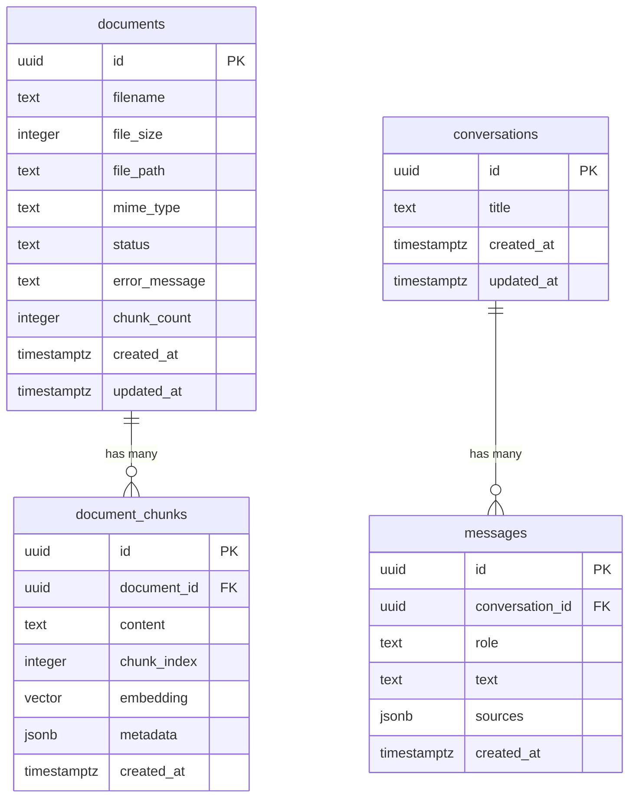
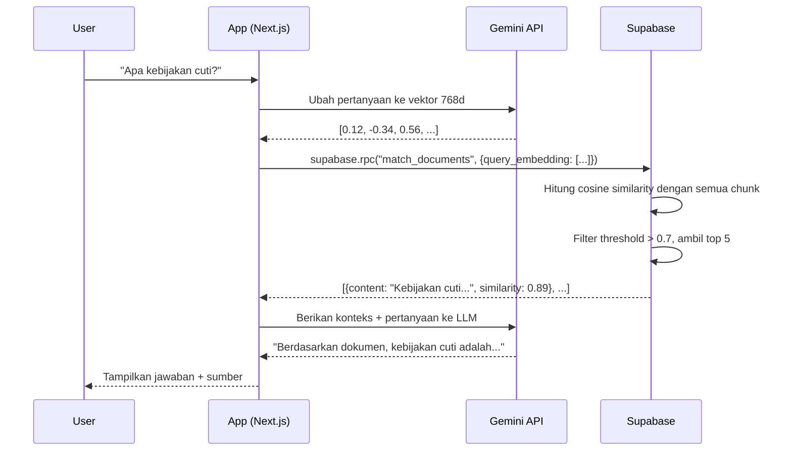

# Essential Supabase Concepts

> Panduan memahami Supabase dan bagaimana Janasku menggunakannya sebagai backend database, storage, dan vector search.

---

## Daftar Isi

1. [Apa itu Supabase](#1-apa-itu-supabase)
2. [Supabase Client](#2-supabase-client)
3. [4 Tabel Utama](#3-4-tabel-utama)
4. [Relasi Antar Tabel](#4-relasi-antar-tabel)
5. [CRUD Pattern](#5-crud-pattern)
6. [Supabase Storage](#6-supabase-storage)
7. [pgvector -- Extension untuk Vector Search](#7-pgvector----extension-untuk-vector-search)
8. [RPC match_documents](#8-rpc-match_documents)
9. [RLS (Row Level Security)](#9-rls-row-level-security)
10. [Auto-generated Types](#10-auto-generated-types)

---

## 1. Apa itu Supabase

### Penjelasan Singkat

Supabase adalah **BaaS (Backend as a Service)** -- sebuah platform yang menyediakan backend siap pakai sehingga kamu tidak perlu membangun server dari nol. Supabase dibangun di atas **PostgreSQL**, database relasional paling canggih yang open-source.

### Analogi Dunia Nyata

Bayangkan kamu mau buka warung makan. Kamu punya dua pilihan:

1. **Bangun dari nol**: Beli tanah, bangun gedung, pasang listrik, beli kompor, buat dapur -- baru bisa mulai masak.
2. **Sewa ruko yang sudah lengkap**: Sudah ada dapur, listrik, air, meja kursi -- kamu tinggal fokus masak dan melayani pelanggan.

Supabase itu pilihan nomor 2. Kamu langsung dapat:

| Fitur               | Analogi Warung                | Di Supabase            |
|----------------------|-------------------------------|------------------------|
| Database             | Buku catatan pesanan & stok   | PostgreSQL             |
| Authentication       | Sistem kartu member           | Supabase Auth          |
| Storage              | Gudang penyimpanan bahan      | Supabase Storage       |
| Realtime             | Bel yang bunyi saat ada order | Realtime subscriptions |
| Edge Functions       | Koki spesialis yang dipanggil saat perlu | Serverless Functions |

Di project Janasku, kita menggunakan tiga fitur utama: **Database** (PostgreSQL + pgvector), **Storage** (menyimpan file PDF/TXT), dan **RPC** (menjalankan fungsi SQL untuk vector search).

---

## 2. Supabase Client

### Cara Kerja

Untuk berkomunikasi dengan Supabase dari kode Next.js, kita memerlukan sebuah **client** -- semacam "kurir" yang mengantar permintaan kita ke server Supabase dan membawa hasilnya kembali.

Berikut setup client di project Janasku:

```typescript
// File: src/shared/lib/supabase.ts

import { createClient } from "@supabase/supabase-js";

const supabaseUrl = process.env.SUPABASE_URL;
const supabaseKey = process.env.SUPABASE_SERVICE_ROLE_KEY;

if (!supabaseUrl || !supabaseKey) {
  throw new Error(
    "Missing SUPABASE_URL or SUPABASE_SERVICE_ROLE_KEY environment variables"
  );
}

export const supabase = createClient(supabaseUrl, supabaseKey);
```

### Penjelasan Baris per Baris

| Baris | Penjelasan |
|-------|------------|
| `import { createClient }` | Mengimpor fungsi pembuat client dari library `@supabase/supabase-js` |
| `process.env.SUPABASE_URL` | URL project Supabase kamu (mis. `https://abc123.supabase.co`) |
| `process.env.SUPABASE_SERVICE_ROLE_KEY` | Kunci rahasia yang memberikan akses penuh ke database (hanya untuk server-side!) |
| `if (!supabaseUrl \|\| !supabaseKey)` | Validasi: kalau environment variable belum diisi, aplikasi langsung error supaya tidak diam-diam gagal |
| `export const supabase = createClient(...)` | Membuat satu instance client yang dipakai di seluruh aplikasi |

### Penting: Service Role Key vs Anon Key

- **Service Role Key**: Seperti kunci master hotel -- bisa buka semua pintu. Hanya boleh dipakai di server (Next.js Server Actions/API Routes). **Jangan pernah kirim ke browser!**
- **Anon Key**: Seperti kunci kamar tamu -- akses terbatas sesuai RLS policy. Aman untuk browser.

Di Janasku, kita pakai Service Role Key karena semua operasi database berjalan di **server** melalui Next.js Server Actions (`"use server"`).

---

## 3. 4 Tabel Utama

Janasku memiliki 4 tabel utama yang dibagi dalam 2 migration file. Mari kita bedah satu per satu.

### 3.1 Tabel `documents`

Menyimpan metadata file yang diupload ke knowledge base.

```sql
-- File: supabase/migrations/20260228100000_create_rag_infrastructure.sql

create table documents (
  id uuid primary key default gen_random_uuid(),
  filename text not null,
  file_size integer not null,
  file_path text not null,
  mime_type text not null,
  status text not null default 'uploading'
    check (status in ('uploading', 'processing', 'ready', 'error')),
  error_message text,
  chunk_count integer not null default 0,
  created_at timestamptz not null default now(),
  updated_at timestamptz not null default now()
);
```

| Kolom | Tipe | Penjelasan |
|-------|------|------------|
| `id` | `uuid` | ID unik, auto-generate pakai `gen_random_uuid()` |
| `filename` | `text` | Nama asli file (mis. `panduan-karyawan.pdf`) |
| `file_size` | `integer` | Ukuran file dalam bytes |
| `file_path` | `text` | Path file di Supabase Storage |
| `mime_type` | `text` | Tipe file (`application/pdf` atau `text/plain`) |
| `status` | `text` | Status pemrosesan: `uploading` -> `processing` -> `ready` / `error` |
| `error_message` | `text` | Pesan error jika processing gagal (nullable) |
| `chunk_count` | `integer` | Jumlah chunk yang dihasilkan setelah processing |
| `created_at` | `timestamptz` | Waktu upload |
| `updated_at` | `timestamptz` | Waktu update terakhir |

**Analogi**: Tabel ini seperti **katalog perpustakaan** -- menyimpan informasi tentang buku, tapi bukan isi bukunya.

### 3.2 Tabel `document_chunks`

Menyimpan potongan teks dari dokumen beserta vector embedding-nya.

```sql
-- File: supabase/migrations/20260228100000_create_rag_infrastructure.sql

create table document_chunks (
  id uuid primary key default gen_random_uuid(),
  document_id uuid not null references documents(id) on delete cascade,
  content text not null,
  chunk_index integer not null,
  embedding extensions.vector(768),
  metadata jsonb default '{}'::jsonb,
  created_at timestamptz not null default now()
);
```

| Kolom | Tipe | Penjelasan |
|-------|------|------------|
| `id` | `uuid` | ID unik chunk |
| `document_id` | `uuid` | Foreign key ke tabel `documents` (parent) |
| `content` | `text` | Isi teks dari potongan dokumen |
| `chunk_index` | `integer` | Urutan chunk (0, 1, 2, ...) |
| `embedding` | `vector(768)` | Representasi vektor 768 dimensi dari teks (untuk similarity search) |
| `metadata` | `jsonb` | Informasi tambahan (halaman, posisi, dll) |
| `created_at` | `timestamptz` | Waktu chunk dibuat |

**Analogi**: Kalau `documents` adalah katalog buku, maka `document_chunks` adalah **halaman-halaman buku** yang sudah dipotong dan diberi stempel kode (embedding) supaya bisa dicari berdasarkan kemiripan makna.

Perhatikan `on delete cascade` -- artinya kalau dokumen induk dihapus, semua chunk-nya otomatis ikut terhapus. Seperti membuang buku beserta semua halamannya.

### 3.3 Tabel `conversations`

Menyimpan sesi percakapan pengguna dengan chatbot.

```sql
-- File: supabase/migrations/20260228120000_create_chat_history.sql

create table conversations (
  id uuid primary key default gen_random_uuid(),
  title text not null default 'Percakapan Baru',
  created_at timestamptz not null default now(),
  updated_at timestamptz not null default now()
);

create index conversations_updated_at_idx on conversations (updated_at desc);
```

| Kolom | Tipe | Penjelasan |
|-------|------|------------|
| `id` | `uuid` | ID unik percakapan |
| `title` | `text` | Judul percakapan (default: `'Percakapan Baru'`) |
| `created_at` | `timestamptz` | Waktu percakapan dibuat |
| `updated_at` | `timestamptz` | Waktu pesan terakhir dikirim |

Index `conversations_updated_at_idx` memastikan query pengurutan berdasarkan `updated_at DESC` (percakapan terbaru di atas) berjalan cepat.

**Analogi**: Tabel ini seperti **daftar grup chat** di WhatsApp -- setiap item punya judul dan waktu update terakhir.

### 3.4 Tabel `messages`

Menyimpan setiap pesan dalam percakapan.

```sql
-- File: supabase/migrations/20260228120000_create_chat_history.sql

create table messages (
  id uuid primary key default gen_random_uuid(),
  conversation_id uuid not null references conversations(id) on delete cascade,
  role text not null check (role in ('user', 'assistant')),
  text text not null,
  sources jsonb default '[]'::jsonb,
  created_at timestamptz not null default now()
);

create index messages_conversation_created_idx
  on messages (conversation_id, created_at asc);
```

| Kolom | Tipe | Penjelasan |
|-------|------|------------|
| `id` | `uuid` | ID unik pesan |
| `conversation_id` | `uuid` | Foreign key ke `conversations` |
| `role` | `text` | Siapa pengirim: `'user'` atau `'assistant'` |
| `text` | `text` | Isi pesan |
| `sources` | `jsonb` | Sumber referensi yang dipakai assistant untuk menjawab |
| `created_at` | `timestamptz` | Waktu pesan dikirim |

**Composite index** `(conversation_id, created_at asc)` memastikan query "ambil semua pesan di percakapan X, urutkan dari lama ke baru" berjalan cepat.

**Analogi**: Tabel ini seperti **isi chat** di dalam grup WhatsApp -- setiap bubble pesan punya pengirim, isi, dan waktu.

---

## 4. Relasi Antar Tabel

### ER Diagram



### Penjelasan Relasi

Ada **dua domain** yang terpisah di database Janasku:

| Domain | Tabel | Relasi | Penjelasan |
|--------|-------|--------|------------|
| **Knowledge Base** | `documents` -> `document_chunks` | One-to-Many | Satu dokumen punya banyak chunk. Hapus dokumen = hapus semua chunk (cascade). |
| **Chat History** | `conversations` -> `messages` | One-to-Many | Satu percakapan punya banyak pesan. Hapus percakapan = hapus semua pesan (cascade). |

Kedua domain ini **tidak terhubung langsung** lewat foreign key. Mereka terhubung secara logis melalui kolom `sources` di tabel `messages`, yang menyimpan referensi dokumen mana yang digunakan saat menjawab pertanyaan.

---

## 5. CRUD Pattern

Supabase menyediakan query builder yang sintaksnya mirip bahasa sehari-hari. Berikut pola CRUD yang dipakai di Janasku.

### 5.1 SELECT (Read)

Mengambil data dari tabel.

```typescript
// File: src/features/chat/actions/conversation-actions.ts

export async function getConversations(): Promise<Conversation[]> {
  const { data, error } = await supabase
    .from("conversations")
    .select("*")
    .order("updated_at", { ascending: false });

  if (error) {
    throw new Error(`Failed to fetch conversations: ${error.message}`);
  }

  return data;
}
```

**Penjelasan**:
- `.from("conversations")` -- pilih tabel mana
- `.select("*")` -- ambil semua kolom (`*` = wildcard)
- `.order("updated_at", { ascending: false })` -- urutkan dari terbaru
- Hasilnya berupa `{ data, error }` -- selalu cek error!

Contoh lain dengan **filter** (`WHERE`):

```typescript
// File: src/features/chat/actions/conversation-actions.ts

export async function getMessages(
  conversationId: string
): Promise<ChatMessage[]> {
  const { data, error } = await supabase
    .from("messages")
    .select("*")
    .eq("conversation_id", conversationId)
    .order("created_at", { ascending: true });

  if (error) {
    throw new Error(`Failed to fetch messages: ${error.message}`);
  }

  return data.map((msg) => ({
    id: msg.id,
    role: msg.role,
    text: msg.text,
    sources: msg.sources?.length ? msg.sources : undefined,
    createdAt: msg.created_at,
  }));
}
```

- `.eq("conversation_id", conversationId)` -- filter dimana `conversation_id` sama dengan nilai yang diberikan (equivalen SQL: `WHERE conversation_id = '...'`)

### 5.2 INSERT (Create)

Menambahkan data baru ke tabel.

```typescript
// File: src/features/chat/actions/conversation-actions.ts

export async function createConversation(
  title: string
): Promise<Conversation> {
  const { data, error } = await supabase
    .from("conversations")
    .insert({ title })
    .select()
    .single();

  if (error) {
    throw new Error(`Failed to create conversation: ${error.message}`);
  }

  return data;
}
```

**Penjelasan**:
- `.insert({ title })` -- masukkan data baru (kolom yang punya `default` tidak perlu diisi)
- `.select()` -- setelah insert, kembalikan data yang baru dibuat (termasuk `id` yang auto-generate)
- `.single()` -- kita hanya insert 1 row, jadi expect 1 hasil (bukan array)

### 5.3 UPDATE

Mengubah data yang sudah ada.

```typescript
// File: src/features/chat/actions/conversation-actions.ts

export async function renameConversation(
  id: string,
  title: string
): Promise<void> {
  const { error } = await supabase
    .from("conversations")
    .update({ title, updated_at: new Date().toISOString() })
    .eq("id", id);

  if (error) {
    throw new Error(`Failed to rename conversation: ${error.message}`);
  }
}
```

**Penjelasan**:
- `.update({ title, updated_at: ... })` -- update kolom yang disebutkan saja (partial update)
- `.eq("id", id)` -- **wajib!** Tanpa filter, SEMUA row akan terupdate

### 5.4 DELETE

Menghapus data dari tabel.

```typescript
// File: src/features/chat/actions/conversation-actions.ts

export async function deleteConversation(id: string): Promise<void> {
  const { error } = await supabase
    .from("conversations")
    .delete()
    .eq("id", id);

  if (error) {
    throw new Error(`Failed to delete conversation: ${error.message}`);
  }
}
```

**Penjelasan**:
- `.delete()` -- hapus row
- `.eq("id", id)` -- **wajib!** Tanpa filter, SEMUA row akan terhapus

### Ringkasan Pola CRUD

| Operasi | Method | Wajib Filter? | Return Data? |
|---------|--------|---------------|--------------|
| SELECT  | `.select("*")` | Opsional (`.eq()`, `.order()`) | Ya, selalu `{ data, error }` |
| INSERT  | `.insert({...})` | Tidak | Tambahkan `.select()` jika perlu data kembali |
| UPDATE  | `.update({...})` | **Ya!** Pakai `.eq()` | Opsional |
| DELETE  | `.delete()` | **Ya!** Pakai `.eq()` | Opsional |

---

## 6. Supabase Storage

Supabase Storage digunakan untuk menyimpan file (PDF, TXT) yang diupload pengguna. Cara kerjanya mirip Google Drive -- kamu upload file ke "bucket" dan bisa download/hapus nanti.

### Setup Bucket (di Migration)

```sql
-- File: supabase/migrations/20260228100000_create_rag_infrastructure.sql

insert into storage.buckets (id, name, public)
values ('documents', 'documents', false)
on conflict (id) do nothing;
```

- Bucket bernama `documents` dibuat sebagai **private** (`public = false`) -- file tidak bisa diakses langsung via URL tanpa autentikasi.

### Upload File

```typescript
// File: src/features/knowledge-base/actions/document-actions.ts

const filePath = `${crypto.randomUUID()}-${file.name}`;
const { error: storageError } = await supabase.storage
  .from("documents")
  .upload(filePath, file);
```

**Penjelasan**:
- `crypto.randomUUID()` -- generate nama unik agar file tidak bentrok
- `.from("documents")` -- pilih bucket `documents`
- `.upload(filePath, file)` -- upload file ke path yang ditentukan

### Delete File

```typescript
// File: src/features/knowledge-base/actions/document-actions.ts

await supabase.storage.from("documents").remove([doc.file_path]);
```

**Penjelasan**:
- `.remove([...paths])` -- hapus file berdasarkan path (bisa multiple file sekaligus, makanya pakai array)

### Pola Upload + Rollback

Perhatikan bagaimana kode Janasku menangani error dengan **rollback**:

```typescript
// File: src/features/knowledge-base/actions/document-actions.ts

// 1. Upload ke Storage
const { error: storageError } = await supabase.storage
  .from("documents")
  .upload(filePath, file);

if (storageError) {
  return { error: `Gagal mengunggah file: ${storageError.message}` };
}

// 2. Simpan metadata ke database
const { data, error: dbError } = await supabase
  .from("documents")
  .insert({
    filename: file.name,
    file_size: file.size,
    file_path: filePath,
    mime_type: file.type,
    status: "uploading",
  })
  .select("id")
  .single();

if (dbError) {
  // Rollback: hapus file dari storage karena insert DB gagal
  await supabase.storage.from("documents").remove([filePath]);
  return { error: `Gagal menyimpan metadata: ${dbError.message}` };
}
```

**Analogi**: Ini seperti belanja online -- kalau pembayaran gagal, barang dikembalikan ke rak. File yang sudah terlanjur diupload harus dihapus kalau proses selanjutnya gagal.

---

## 7. pgvector -- Extension untuk Vector Search

### Apa itu pgvector?

pgvector adalah **extension PostgreSQL** yang menambahkan kemampuan menyimpan dan mencari data vektor. Ini adalah inti dari fitur RAG (Retrieval-Augmented Generation) di Janasku.

### Analogi Dunia Nyata

Bayangkan kamu punya perpustakaan dengan ribuan buku. Ada dua cara mencari:

1. **Pencarian kata kunci** (tradisional): Cari buku yang judulnya mengandung kata "memasak". Kalau kamu mengetik "resep makanan", tidak ketemu -- padahal maknanya mirip.
2. **Pencarian makna** (vector search): Setiap buku direpresentasikan sebagai titik di ruang 768 dimensi. "Memasak" dan "resep makanan" akan berada di titik yang berdekatan. Kita cari buku-buku yang "jaraknya dekat" dengan pertanyaan kita.

pgvector memungkinkan opsi nomor 2.

### Aktivasi Extension

```sql
-- File: supabase/migrations/20260228100000_create_rag_infrastructure.sql

create extension if not exists vector with schema extensions;
```

### Kolom `vector(768)`

```sql
embedding extensions.vector(768)
```

- `vector(768)` artinya kolom ini menyimpan array angka berukuran **768 elemen** (dimensi)
- Angka 768 sesuai dengan dimensi output model embedding yang digunakan (Gemini embedding model)
- Setiap chunk dokumen dikonversi menjadi vektor 768 dimensi yang merepresentasikan "makna" teksnya

### IVFFlat Index

```sql
-- File: supabase/migrations/20260228100000_create_rag_infrastructure.sql

create index on document_chunks
  using ivfflat (embedding extensions.vector_cosine_ops)
  with (lists = 100);
```

**Penjelasan**:
- `ivfflat` = **Inverted File Flat** -- algoritma indexing untuk mempercepat pencarian vektor
- `vector_cosine_ops` = menggunakan **cosine distance** sebagai metrik kemiripan
- `lists = 100` = membagi vektor menjadi 100 cluster untuk mempercepat pencarian

**Analogi**: Tanpa index, mencari vektor yang mirip itu seperti **mencari jarum di tumpukan jerami** -- harus bandingkan satu per satu dengan semua vektor. Dengan IVFFlat, vektor-vektor dikelompokkan ke 100 "laci". Saat mencari, kita cukup buka beberapa laci yang paling mungkin berisi jarum, bukan membongkar semua laci.

| Tanpa Index | Dengan IVFFlat Index |
|-------------|---------------------|
| Bandingkan dengan SEMUA vektor | Bandingkan hanya dengan vektor di cluster terdekat |
| Akurasi 100% | Akurasi ~95-99% (trade-off yang layak) |
| Lambat untuk data besar | Jauh lebih cepat |

---

## 8. RPC match_documents

### Apa itu RPC?

RPC (Remote Procedure Call) di Supabase memungkinkan kamu menjalankan **fungsi SQL custom** dari kode JavaScript. Ini berguna ketika query standar tidak cukup -- seperti vector similarity search.

### Fungsi SQL: Step-by-Step

```sql
-- File: supabase/migrations/20260228100000_create_rag_infrastructure.sql

create or replace function match_documents(
  query_embedding extensions.vector(768),
  match_threshold float default 0.7,
  match_count int default 5
)
returns table (
  id uuid,
  document_id uuid,
  content text,
  chunk_index int,
  metadata jsonb,
  similarity float,
  filename text
)
language plpgsql
as $$
begin
  return query
  select
    dc.id,
    dc.document_id,
    dc.content,
    dc.chunk_index,
    dc.metadata,
    1 - (dc.embedding <=> query_embedding) as similarity,
    d.filename
  from document_chunks dc
  join documents d on d.id = dc.document_id
  where d.status = 'ready'
    and 1 - (dc.embedding <=> query_embedding) > match_threshold
  order by dc.embedding <=> query_embedding
  limit match_count;
end;
$$;
```

### Breakdown Langkah per Langkah

**Step 1: Parameter Input**

```sql
query_embedding extensions.vector(768),  -- vektor pertanyaan user
match_threshold float default 0.7,       -- batas minimum kemiripan (0-1)
match_count int default 5                -- jumlah hasil maksimum
```

- `query_embedding` adalah pertanyaan user yang sudah dikonversi menjadi vektor 768 dimensi
- `match_threshold = 0.7` artinya hanya chunk dengan kemiripan > 70% yang dikembalikan
- `match_count = 5` artinya maksimal 5 chunk teratas

**Step 2: Menghitung Similarity**

```sql
1 - (dc.embedding <=> query_embedding) as similarity
```

- Operator `<=>` menghitung **cosine distance** (jarak) antara dua vektor
- Cosine distance berkisar 0 (identik) sampai 2 (berlawanan)
- `1 - distance` mengubahnya menjadi **similarity** (kemiripan): 1 = identik, 0 = tidak mirip

**Step 3: JOIN dengan Documents**

```sql
from document_chunks dc
join documents d on d.id = dc.document_id
where d.status = 'ready'
```

- Hanya ambil chunk dari dokumen yang statusnya `'ready'` (sudah selesai diproses)
- JOIN dengan `documents` untuk mendapatkan `filename`

**Step 4: Filter dan Urutkan**

```sql
where ... and 1 - (dc.embedding <=> query_embedding) > match_threshold
order by dc.embedding <=> query_embedding
limit match_count;
```

- Buang chunk yang similarity-nya di bawah threshold
- Urutkan dari yang paling mirip (jarak terkecil)
- Ambil maksimal `match_count` hasil

### Pemanggilan dari TypeScript

```typescript
// File: src/features/chat/lib/vector-search.ts

export async function searchDocuments(
  queryEmbedding: number[],
  threshold: number = 0.7,
  count: number = 5
): Promise<SearchResult[]> {
  const { data, error } = await supabase.rpc("match_documents", {
    query_embedding: JSON.stringify(queryEmbedding),
    match_threshold: threshold,
    match_count: count,
  });

  if (error) {
    throw new Error(`Vector search failed: ${error.message}`);
  }

  return data ?? [];
}
```

**Penjelasan**:
- `supabase.rpc("match_documents", {...})` -- panggil fungsi SQL `match_documents`
- `JSON.stringify(queryEmbedding)` -- vektor dikonversi ke string JSON karena Supabase RPC memerlukan format string untuk tipe vector
- Hasilnya array `SearchResult` berisi chunk beserta skor `similarity`-nya

### Alur Lengkap Vector Search



---

## 9. RLS (Row Level Security)

### Apa itu RLS?

RLS adalah fitur PostgreSQL yang memungkinkan kamu mengontrol **siapa boleh akses baris data mana**. Seperti security guard di gedung kantor -- menentukan siapa boleh masuk ke lantai mana.

### Pendekatan MVP: "Allow All"

Di Janasku (tahap MVP), semua tabel menggunakan policy **allow all** -- artinya siapa saja boleh akses semua data:

```sql
-- File: supabase/migrations/20260228100000_create_rag_infrastructure.sql

alter table documents enable row level security;
create policy "Allow all operations on documents"
  on documents for all using (true) with check (true);
```

```sql
-- File: supabase/migrations/20260228120000_create_chat_history.sql

alter table conversations enable row level security;
create policy "Allow all operations on conversations"
  on conversations for all using (true) with check (true);
```

**Penjelasan**:
- `enable row level security` -- **wajib** diaktifkan di Supabase. Kalau tidak, tabel tidak bisa diakses via Supabase client
- `for all` -- berlaku untuk semua operasi (SELECT, INSERT, UPDATE, DELETE)
- `using (true)` -- semua row bisa dibaca (tidak ada filter)
- `with check (true)` -- semua data bisa ditulis (tidak ada validasi)

### Kenapa "Allow All"?

| Alasan | Penjelasan |
|--------|------------|
| **MVP Focus** | Di tahap awal, fokus pada fitur, bukan keamanan multi-user |
| **Single-user** | Janasku saat ini dipakai satu user/organisasi |
| **Service Role Key** | Kita pakai service role key yang bypass RLS, jadi policy ini terutama untuk keamanan jika nanti ada akses dari client-side |
| **Iterasi nanti** | Saat menambahkan fitur auth, kita bisa ubah policy jadi per-user |

### Contoh Policy di Masa Depan (Referensi)

Jika nanti Janasku menambahkan autentikasi, policy-nya bisa diubah menjadi:

```sql
-- Contoh: user hanya bisa lihat percakapan miliknya sendiri
create policy "Users can only see their own conversations"
  on conversations for select
  using (auth.uid() = user_id);
```

### Policy Storage

Supabase Storage juga punya RLS-nya sendiri:

```sql
-- File: supabase/migrations/20260228100000_create_rag_infrastructure.sql

create policy "Allow all uploads to documents bucket"
  on storage.objects for insert
  with check (bucket_id = 'documents');

create policy "Allow all reads from documents bucket"
  on storage.objects for select
  using (bucket_id = 'documents');

create policy "Allow all deletes from documents bucket"
  on storage.objects for delete
  using (bucket_id = 'documents');
```

Policy ini memastikan operasi hanya berlaku untuk bucket `documents`, bukan bucket lain yang mungkin ada di project yang sama.

---

## 10. Auto-generated Types

### Apa itu `database.types.ts`?

Supabase bisa men-generate file TypeScript yang berisi **tipe data untuk semua tabel, fungsi, dan enum** di database kamu. Ini memastikan kode TypeScript kamu selalu sinkron dengan skema database.

File ini ada di:

```
src/shared/lib/database.types.ts
```

### Contoh Tipe yang Di-generate

Berikut potongan dari file `database.types.ts` untuk tabel `documents`:

```typescript
// File: src/shared/lib/database.types.ts

documents: {
  Row: {
    chunk_count: number
    created_at: string
    error_message: string | null
    file_path: string
    file_size: number
    filename: string
    id: string
    mime_type: string
    status: string
    updated_at: string
  }
  Insert: {
    chunk_count?: number       // opsional (ada default di DB)
    created_at?: string        // opsional (ada default di DB)
    error_message?: string | null
    file_path: string          // wajib
    file_size: number          // wajib
    filename: string           // wajib
    id?: string                // opsional (auto-generate)
    mime_type: string          // wajib
    status?: string            // opsional (ada default di DB)
    updated_at?: string        // opsional (ada default di DB)
  }
  Update: {
    // Semua opsional karena partial update
    chunk_count?: number
    created_at?: string
    error_message?: string | null
    file_path?: string
    file_size?: number
    filename?: string
    id?: string
    mime_type?: string
    status?: string
    updated_at?: string
  }
}
```

### Tiga Varian Tipe

| Varian | Kegunaan | Field Wajib? |
|--------|----------|--------------|
| `Row` | Hasil query SELECT | Semua field ada (tidak ada `?`) |
| `Insert` | Data untuk INSERT | Hanya field tanpa default yang wajib |
| `Update` | Data untuk UPDATE | Semua opsional (partial update) |

### Fungsi RPC juga Di-generate

```typescript
// File: src/shared/lib/database.types.ts

match_documents: {
  Args: {
    match_count?: number
    match_threshold?: number
    query_embedding: string
  }
  Returns: {
    chunk_index: number
    content: string
    document_id: string
    filename: string
    id: string
    metadata: Json
    similarity: number
  }[]
}
```

Ini memastikan saat kamu memanggil `supabase.rpc("match_documents", {...})`, TypeScript tahu parameter apa yang valid dan hasil seperti apa yang dikembalikan.

### Cara Generate Ulang

Jika kamu mengubah skema database (tambah tabel, kolom, dll), jalankan:

```bash
npx supabase gen types typescript --local > src/shared/lib/database.types.ts
```

Atau jika terhubung ke project Supabase remote:

```bash
npx supabase gen types typescript --project-id YOUR_PROJECT_ID > src/shared/lib/database.types.ts
```

---

## Rangkuman

| Konsep | Ringkasan |
|--------|-----------|
| **Supabase** | BaaS berbasis PostgreSQL -- database, storage, auth dalam satu platform |
| **Supabase Client** | `createClient(url, key)` -- kurir antara kode kamu dan server Supabase |
| **4 Tabel** | `documents`, `document_chunks` (knowledge base) + `conversations`, `messages` (chat history) |
| **CRUD** | `.select()`, `.insert()`, `.update()`, `.delete()` -- selalu cek `error` |
| **Storage** | Upload/download/delete file ke bucket -- terpisah dari database |
| **pgvector** | Extension PostgreSQL untuk menyimpan dan mencari vektor (embedding) |
| **match_documents** | Fungsi RPC yang menghitung cosine similarity dan mengembalikan chunk paling relevan |
| **RLS** | Row Level Security -- MVP pakai "allow all", nanti bisa per-user |
| **database.types.ts** | Tipe TypeScript auto-generate dari skema database -- jaga sinkronisasi tipe |

---

## Navigasi

- Sebelumnya: `essential_nextjs_concept.md`
- Selanjutnya: `essential_rag_system.md` untuk memahami bagaimana RAG system bekerja.
