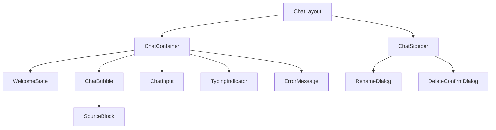
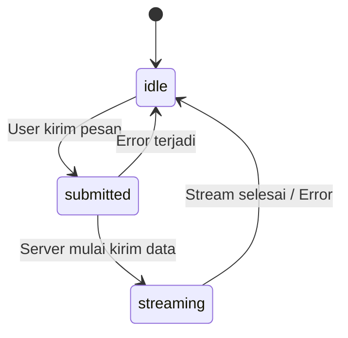
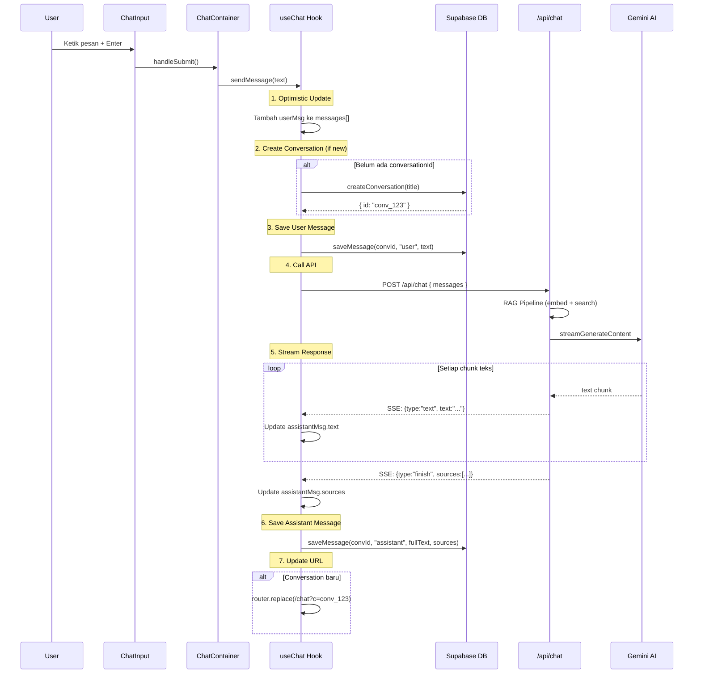
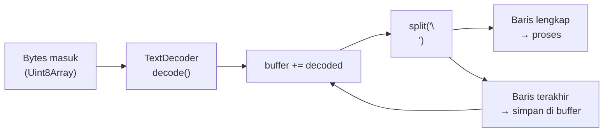
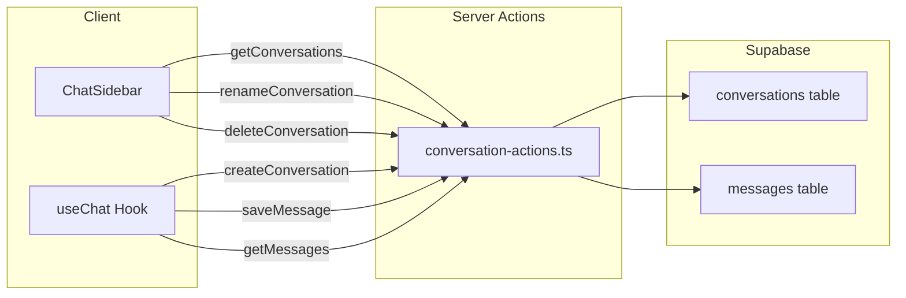
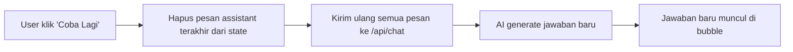

# Mekanika Chatbot: Percakapan Bolak-Balik

> Dokumen ini menjelaskan bagaimana chatbot Janasku bekerja dari sisi frontend -- mulai dari kamu mengetik pertanyaan, pesan dikirim ke server, respons AI di-stream balik, sampai muncul di layar sebagai bubble chat. Anggap ini seperti membedah WhatsApp versi mini yang bisa ngobrol sama AI.

---

## Daftar Isi

1. [Component Tree Diagram](#1-component-tree-diagram)
2. [useChat Hook -- Otak dari Chatbot](#2-usechat-hook----otak-dari-chatbot)
3. [Alur sendMessage() Step-by-Step](#3-alur-sendmessage-step-by-step)
4. [SSE Streaming -- Respons yang Mengalir](#4-sse-streaming----respons-yang-mengalir)
5. [Komponen UI Satu per Satu](#5-komponen-ui-satu-per-satu)
6. [Conversation Persistence -- Menyimpan Riwayat](#6-conversation-persistence----menyimpan-riwayat)
7. [Regenerate -- Minta AI Jawab Ulang](#7-regenerate----minta-ai-jawab-ulang)
8. [Error Handling -- Ketika Ada yang Salah](#8-error-handling----ketika-ada-yang-salah)
9. [Rangkuman](#9-rangkuman)

---

## 1. Component Tree Diagram

Sebelum masuk ke logika, kita perlu paham dulu "siapa memanggil siapa" di antara komponen-komponen chatbot ini. Bayangkan seperti pohon keluarga -- ada induk, ada anak, ada cucu.



**Cara bacanya:**

| Komponen | Peran | Analogi |
|---|---|---|
| `ChatLayout` | Tata letak utama: sidebar + area chat | Denah rumah -- ruang tamu + dapur |
| `ChatSidebar` | Daftar percakapan, buat baru, rename, hapus | Daftar kontak di WhatsApp |
| `ChatContainer` | Orkestrasi semua komponen chat | Ruang obrolan utama |
| `WelcomeState` | Tampilan awal saat belum ada pesan | Layar "Selamat datang" |
| `ChatBubble` | Satu gelembung pesan (user atau assistant) | Balon chat di WhatsApp |
| `ChatInput` | Tempat mengetik pesan | Kolom input di bawah chat |
| `TypingIndicator` | Animasi "AI sedang mengetik..." | Tiga titik bergerak |
| `ErrorMessage` | Pesan error + tombol retry | Notifikasi "Gagal kirim" |
| `SourceBlock` | Menampilkan sumber dokumen referensi | Catatan kaki di buku |

**File kunci yang perlu kamu buka:**
- `src/features/chat/components/chat-layout.tsx` -- entry point
- `src/features/chat/components/chat-container.tsx` -- pusat orkestrasi
- `src/features/chat/hooks/use-chat.ts` -- state management

---

## 2. useChat Hook -- Otak dari Chatbot

Hook `useChat` adalah **jantung** dari seluruh mekanika chatbot. Semua logika penting hidup di sini: mengelola pesan, mengirim ke API, menerima streaming, menyimpan ke database.

**Analogi:** Kalau chatbot ini sebuah restoran, `useChat` adalah kepala koki -- dia yang menerima pesanan (pesan user), memasak (memanggil API), dan menyajikan hasilnya (update UI).

**File:** `src/features/chat/hooks/use-chat.ts`

### State yang Dikelola

```ts
// src/features/chat/hooks/use-chat.ts

type ChatStatus = "idle" | "submitted" | "streaming";

const [messages, setMessages] = useState<ChatMessage[]>([]);
const [status, setStatus] = useState<ChatStatus>("idle");
const [error, setError] = useState<Error | null>(null);
const [isLoadingHistory, setIsLoadingHistory] = useState(false);
```

| State | Tipe | Penjelasan | Analogi |
|---|---|---|---|
| `messages` | `ChatMessage[]` | Semua pesan dalam percakapan aktif | Isi chat room |
| `status` | `"idle" \| "submitted" \| "streaming"` | Status saat ini -- diam, sudah kirim, atau sedang terima stream | Lampu lalu lintas |
| `error` | `Error \| null` | Error terakhir kalau ada | Alarm kebakaran |
| `isLoadingHistory` | `boolean` | Sedang memuat riwayat chat dari database | Loading spinner |
| `conversationId` | `string \| null` | ID percakapan dari URL query `?c=xxx` | Nomor ruangan |

### Tipe Data Pesan

```ts
// src/features/chat/types.ts

export type ChatMessage = {
  id: string;
  role: "user" | "assistant";
  text: string;
  sources?: ChatSource[];
  createdAt: string;
};

export type ChatSource = {
  filename: string;
  chunkIndex: number;
};
```

### Status Flow



**Kenapa ada 3 status, bukan cuma "loading" dan "not loading"?**

- `submitted` = pesan sudah dikirim, tapi server belum mulai balas. Di sini kita tampilkan `TypingIndicator`.
- `streaming` = server sudah mulai kirim teks. Di sini kita update bubble chat huruf per huruf.

Dengan memisahkan keduanya, UX jadi lebih halus -- user tahu pasti apa yang sedang terjadi.

### Ref yang Digunakan

```ts
// src/features/chat/hooks/use-chat.ts

const abortRef = useRef<AbortController | null>(null);
const conversationIdRef = useRef<string | null>(conversationId);
const isCreatingRef = useRef(false);
```

| Ref | Kegunaan |
|---|---|
| `abortRef` | Menyimpan `AbortController` supaya bisa membatalkan request yang sedang berjalan |
| `conversationIdRef` | Versi ref dari `conversationId` supaya callback tidak stale |
| `isCreatingRef` | Flag untuk mencegah double-load saat conversation baru dibuat |

> **Kenapa pakai ref, bukan state?** Karena ref tidak menyebabkan re-render. Untuk data yang hanya perlu diakses di dalam callback (bukan ditampilkan di UI), ref lebih efisien.

---

## 3. Alur sendMessage() Step-by-Step

Ini adalah fungsi paling penting. Mari kita bedah langkah demi langkah apa yang terjadi dari detik kamu menekan tombol kirim.

### Sequence Diagram



### Kode Aktualnya

```ts
// src/features/chat/hooks/use-chat.ts

const sendMessage = useCallback(
  async (text: string) => {
    // STEP 1: Optimistic update -- langsung tampilkan pesan user
    const userMsg: ChatMessage = {
      id: generateId(),
      role: "user",
      text,
      createdAt: new Date().toISOString(),
    };
    const updated = [...messages, userMsg];
    setMessages(updated);

    let convId = conversationIdRef.current;

    // STEP 2: Buat conversation baru kalau belum ada
    let isNew = false;
    if (!convId) {
      try {
        isCreatingRef.current = true;
        const title = text.slice(0, 80);
        const conversation = await createConversation(title);
        convId = conversation.id;
        conversationIdRef.current = convId;
        isNew = true;
      } catch (err) {
        setError(
          err instanceof Error ? err : new Error("Failed to create conversation")
        );
        setMessages(messages); // rollback
        toast.error("Gagal memulai percakapan. Periksa koneksi database.");
        return;
      }
    }

    // STEP 3: Simpan pesan user ke database (non-blocking)
    try {
      await saveMessage(convId, "user", text);
    } catch {
      // Pesan tetap ada di local state, tapi hilang kalau refresh
    }

    // STEP 4: Mulai panggil AI
    sendToApi(updated, convId);

    // STEP 5: Update URL setelah API call dimulai
    if (isNew) {
      router.replace(`/chat?c=${convId}`);
    }
  },
  [messages, sendToApi, router]
);
```

### Penjelasan Tiap Step

**Step 1 -- Optimistic Update:**
Pesan user langsung muncul di layar SEBELUM disimpan ke database atau dikirim ke API. Ini membuat UI terasa instan. Kalau gagal, kita rollback.

> **Analogi:** Seperti pelayan yang langsung bilang "Pesanan diterima!" bahkan sebelum ngecek stok dapur. Kalau ternyata habis, baru bilang "Maaf, ternyata kosong."

**Step 2 -- Create Conversation:**
Percakapan baru dibuat hanya saat pesan pertama dikirim, bukan saat halaman dibuka. Judul otomatis diambil dari 80 karakter pertama pesanmu.

**Step 3 -- Save User Message:**
Pesan disimpan ke Supabase. Perhatikan komentar `non-blocking` -- kalau gagal simpan, kita lanjut saja. Pesan tetap ada di layar, tapi akan hilang kalau kamu refresh halaman.

**Step 4 -- sendToApi:**
Ini memulai komunikasi dengan server. Detail streamingnya kita bahas di bagian berikutnya.

**Step 5 -- Update URL:**
URL berubah dari `/chat` ke `/chat?c=conv_123` supaya kalau kamu refresh, percakapan yang sama terbuka lagi.

---

## 4. SSE Streaming -- Respons yang Mengalir

### Apa Itu SSE?

**SSE (Server-Sent Events)** adalah teknologi di mana server bisa mengirim data ke client secara bertahap, bukan sekaligus. Bayangkan seperti menonton subtitle film real-time vs membaca seluruh skrip sekaligus setelah film selesai.

### Sisi Server: Membuat Stream

```ts
// src/app/api/chat/route.ts

const sseStream = new ReadableStream({
  async start(controller) {
    const encoder = new TextEncoder();

    try {
      while (true) {
        const { done, value } = await reader.read();
        if (done) break;
        controller.enqueue(
          encoder.encode(
            `data: ${JSON.stringify({ type: "text", text: value })}\n\n`
          )
        );
      }

      // Kirim sumber referensi di akhir
      controller.enqueue(
        encoder.encode(
          `data: ${JSON.stringify({ type: "finish", sources })}\n\n`
        )
      );
      controller.enqueue(encoder.encode("data: [DONE]\n\n"));
    } catch (err) {
      const message = err instanceof Error ? err.message : "Stream error";
      controller.enqueue(
        encoder.encode(
          `data: ${JSON.stringify({ type: "error", message })}\n\n`
        )
      );
    } finally {
      controller.close();
    }
  },
});

return new Response(sseStream, {
  headers: {
    "Content-Type": "text/event-stream",
    "Cache-Control": "no-cache",
    Connection: "keep-alive",
  },
});
```

### 3 Tipe Event SSE

| Tipe | Kapan Dikirim | Payload | Contoh |
|---|---|---|---|
| `text` | Setiap ada potongan teks dari AI | `{ type: "text", text: "Janasku adalah..." }` | Huruf/kata mengalir |
| `finish` | Stream selesai | `{ type: "finish", sources: [{filename, chunkIndex}] }` | Sumber dokumen |
| `error` | Terjadi error | `{ type: "error", message: "..." }` | Pesan error |

Ada juga penanda akhir `data: [DONE]\n\n` yang menandakan stream benar-benar selesai.

### Format SSE

Setiap event SSE mengikuti format standar:

```
data: {"type":"text","text":"Janasku "}\n\n
data: {"type":"text","text":"adalah "}\n\n
data: {"type":"text","text":"minuman "}\n\n
data: {"type":"text","text":"herbal."}\n\n
data: {"type":"finish","sources":[{"filename":"produk.pdf","chunkIndex":3}]}\n\n
data: [DONE]\n\n
```

Perhatikan: setiap baris diawali `data: ` dan diakhiri dua newline (`\n\n`). Ini bukan sembarang format -- ini standar SSE yang didefinisikan di spesifikasi HTML.

### Sisi Client: Membaca Stream

```ts
// src/features/chat/hooks/use-chat.ts (di dalam sendToApi)

const reader = res.body!.getReader();
const decoder = new TextDecoder();
let buffer = "";

while (true) {
  const { done, value } = await reader.read();
  if (done) break;

  buffer += decoder.decode(value, { stream: true });
  const lines = buffer.split("\n");
  buffer = lines.pop()!; // simpan baris yang belum lengkap

  for (const line of lines) {
    if (!line.startsWith("data: ")) continue;
    const payload = line.slice(6).trim();
    if (!payload || payload === "[DONE]") continue;

    try {
      const event = JSON.parse(payload);

      if (event.type === "text") {
        fullText += event.text;
        setMessages((prev) =>
          prev.map((m) =>
            m.id === assistantId
              ? { ...m, text: m.text + event.text }
              : m
          )
        );
      } else if (event.type === "finish") {
        finalSources = event.sources;
        setMessages((prev) =>
          prev.map((m) =>
            m.id === assistantId
              ? { ...m, sources: event.sources }
              : m
          )
        );
      } else if (event.type === "error") {
        throw new Error(event.message);
      }
    } catch (e) {
      if (e instanceof SyntaxError) continue; // skip JSON yang rusak
      throw e;
    }
  }
}
```

### Cara Kerja Buffer Parsing



**Kenapa perlu buffer?** Karena data dari network tidak dijamin datang per-baris utuh. Bisa saja satu chunk berisi setengah baris -- misal `data: {"type":"te` -- dan sisanya datang di chunk berikutnya: `xt","text":"hello"}\n\n`. Buffer memastikan kita hanya memproses baris yang sudah lengkap.

> **Analogi:** Seperti menerima surat yang terpotong jadi beberapa amplop. Kamu mengumpulkan potongannya dulu, baru baca kalau sudah lengkap.

---

## 5. Komponen UI Satu per Satu

### 5.1 ChatContainer -- Pusat Orkestrasi

**File:** `src/features/chat/components/chat-container.tsx`

ChatContainer adalah komponen yang menyatukan semuanya. Dia memanggil `useChat()` dan mendistribusikan data ke komponen-komponen anak.

```tsx
// src/features/chat/components/chat-container.tsx

export function ChatContainer() {
  const {
    messages, sendMessage, status, error,
    regenerate, isLoadingHistory, conversationId,
  } = useChat();

  const [input, setInput] = useState("");
  const scrollRef = useRef<HTMLDivElement>(null);
  const isLoading = status === "submitted" || status === "streaming";

  // Auto-scroll saat ada pesan baru
  useEffect(() => {
    if (scrollRef.current) {
      scrollRef.current.scrollTop = scrollRef.current.scrollHeight;
    }
  }, [messages, status]);

  // ...render
}
```

**Auto-scroll:** Setiap kali `messages` atau `status` berubah, scroll otomatis ke bawah. Ini memastikan pesan terbaru selalu terlihat -- persis seperti chat app pada umumnya.

**Logika render utama:**

```tsx
// src/features/chat/components/chat-container.tsx

{messages.length === 0 && !conversationId ? (
  <WelcomeState onSuggestionClick={handleSuggestionClick} />
) : (
  <div ref={scrollRef} className="flex-1 overflow-y-auto py-4">
    {messages.map((message) => {
      // Sembunyikan bubble assistant kosong saat status submitted
      if (message.role === "assistant" && !message.text && status === "submitted")
        return null;
      return <ChatBubble key={message.id} message={message} />;
    })}
    {status === "submitted" && <TypingIndicator />}
    {error && <ErrorMessage onRetry={regenerate} />}
  </div>
)}
```

| Kondisi | Yang Ditampilkan |
|---|---|
| Belum ada pesan & belum ada conversationId | `WelcomeState` |
| Ada pesan | Daftar `ChatBubble` |
| Status = `submitted` | `TypingIndicator` |
| Ada error | `ErrorMessage` dengan tombol retry |

### 5.2 ChatBubble -- Gelembung Pesan

**File:** `src/features/chat/components/chat-bubble.tsx`

Setiap pesan ditampilkan sebagai bubble. Pesan user dan assistant memiliki styling berbeda.

```tsx
// src/features/chat/components/chat-bubble.tsx

export function ChatBubble({ message }: ChatBubbleProps) {
  const isUser = message.role === "user";
  const sources = message.sources ?? [];

  return (
    <div className={`flex gap-3 px-4 py-2 ${isUser ? "flex-row-reverse" : "flex-row"}`}>
      {/* Avatar */}
      <div className={`flex size-8 shrink-0 items-center justify-center rounded-full ${
        isUser ? "bg-primary text-primary-foreground" : "bg-muted"
      }`}>
        {isUser ? <UserIcon className="size-4" /> : <BotIcon className="size-4" />}
      </div>

      <div className={`flex flex-col max-w-[80%] ${isUser ? "items-end" : "items-start"}`}>
        <div className={`rounded-2xl px-4 py-2.5 text-sm ${
          isUser
            ? "bg-primary text-primary-foreground rounded-tr-sm"
            : "bg-muted rounded-tl-sm"
        }`}>
          {isUser ? (
            <p className="whitespace-pre-wrap">{message.text}</p>
          ) : (
            <div className="prose prose-sm dark:prose-invert max-w-none">
              <ReactMarkdown>{message.text}</ReactMarkdown>
            </div>
          )}
        </div>

        {/* Timestamp */}
        <span className={`mt-1 font-light text-muted-foreground/50 ...`}
              style={{ fontSize: "11px" }}>
          {formatTimestamp(message.createdAt)}
        </span>

        {/* Sumber referensi */}
        {!isUser && sources.length > 0 && <SourceBlock sources={sources} />}
      </div>
    </div>
  );
}
```

| Aspek | User | Assistant |
|---|---|---|
| Posisi | Kanan (`flex-row-reverse`) | Kiri (`flex-row`) |
| Warna bubble | `bg-primary` (warna utama) | `bg-muted` (abu-abu) |
| Avatar | `UserIcon` | `BotIcon` |
| Rendering teks | Plain text (`whitespace-pre-wrap`) | Markdown (`ReactMarkdown`) |
| Corner style | `rounded-tr-sm` (kanan atas tajam) | `rounded-tl-sm` (kiri atas tajam) |

**Kenapa assistant pakai Markdown?** Karena AI sering menjawab dengan format: bold, list, code block, dll. `ReactMarkdown` mengubah teks mentah menjadi HTML yang cantik. Teks user tidak perlu ini karena user biasanya menulis plain text.

### 5.3 ChatInput -- Tempat Mengetik

**File:** `src/features/chat/components/chat-input.tsx`

```tsx
// src/features/chat/components/chat-input.tsx

export function ChatInput({ input, isLoading, onInputChange, onSubmit }: ChatInputProps) {
  return (
    <form onSubmit={onSubmit}
          className="sticky bottom-0 flex gap-2 border-t bg-background px-4 py-3">
      <input
        type="text"
        value={input}
        onChange={onInputChange}
        placeholder="Ketik pertanyaan Anda di sini..."
        disabled={isLoading}
        className="flex-1 rounded-lg border bg-background px-4 py-2.5 text-sm ..."
      />
      <Button type="submit" size="icon" disabled={!input.trim() || isLoading}>
        {isLoading ? (
          <Loader2Icon className="size-4 animate-spin" />
        ) : (
          <SendIcon className="size-4" />
        )}
      </Button>
    </form>
  );
}
```

Hal-hal penting:
- `sticky bottom-0` -- input selalu menempel di bawah, tidak ikut scroll.
- `disabled={isLoading}` -- input dimatikan saat AI sedang menjawab, mencegah spam.
- Tombol kirim berubah jadi spinner (`Loader2Icon`) saat loading.
- Submit terjadi via `<form onSubmit>`, jadi menekan Enter juga mengirim pesan.

### 5.4 WelcomeState -- Halaman Sambutan

**File:** `src/features/chat/components/welcome-state.tsx`

Ditampilkan saat belum ada pesan. Berisi sambutan dan tombol-tombol saran pertanyaan.

```tsx
// src/features/chat/components/welcome-state.tsx

const suggestions = [
  "Janasku terbuat dari apa?",
  "Bagaimana cara minum Janasku?",
  "Apakah aman untuk ibu hamil?",
  "Apa manfaat Janasku?",
];

export function WelcomeState({ onSuggestionClick }: WelcomeStateProps) {
  return (
    <div className="flex flex-1 flex-col items-center justify-center gap-4 px-6">
      <div className="flex size-16 items-center justify-center rounded-full bg-secondary">
        <BotIcon className="size-8 text-primary" />
      </div>
      <div className="text-center">
        <h2 className="text-lg font-semibold">Halo! Saya Chatbot Janasku.</h2>
        <p className="mt-1 text-sm text-muted-foreground">
          Saya siap membantu menjawab pertanyaan seputar produk kami berdasarkan
          dokumen Knowledge Base.
        </p>
      </div>
      <div className="mt-2 flex flex-wrap justify-center gap-2">
        {suggestions.map((text) => (
          <button key={text} onClick={() => onSuggestionClick(text)}
                  className="flex items-center gap-1.5 rounded-lg border px-3 py-2 text-sm ...">
            <SparklesIcon className="size-3.5 text-primary" />
            {text}
          </button>
        ))}
      </div>
    </div>
  );
}
```

Klik saran pertanyaan = langsung memanggil `sendMessage()` dengan teks saran tersebut. User tidak perlu mengetik apapun -- UX yang ramah untuk pengguna baru.

### 5.5 SourceBlock -- Sumber Referensi

**File:** `src/features/chat/components/source-block.tsx`

Ditampilkan di bawah bubble assistant jika AI menggunakan dokumen sebagai referensi.

```tsx
// src/features/chat/components/source-block.tsx

export function SourceBlock({ sources }: SourceBlockProps) {
  if (sources.length === 0) return null;

  // Deduplikasi berdasarkan nama file
  const uniqueFiles = [...new Set(sources.map((s) => s.filename))];

  return (
    <div className="mt-2 rounded-md border bg-card px-3 py-2">
      <div className="flex items-center gap-1.5 text-xs font-medium text-muted-foreground">
        <PaperclipIcon className="size-3" />
        <span>Sumber Referensi:</span>
      </div>
      <ul className="mt-1 space-y-0.5">
        {uniqueFiles.map((filename) => (
          <li key={filename} className="text-xs text-muted-foreground">
            &bull; {filename}
          </li>
        ))}
      </ul>
    </div>
  );
}
```

Perhatikan deduplikasi: kalau AI mengambil 3 chunk dari file yang sama, yang ditampilkan tetap 1 nama file saja. `new Set()` menghilangkan duplikat.

### 5.6 TypingIndicator -- AI Sedang Berpikir

**File:** `src/features/chat/components/typing-indicator.tsx`

```tsx
// src/features/chat/components/typing-indicator.tsx

export function TypingIndicator() {
  return (
    <div className="flex items-center gap-1 px-4 py-2">
      <div className="flex items-center gap-1 rounded-lg bg-muted px-4 py-3">
        {[0, 1, 2].map((i) => (
          <span key={i}
                className="size-2 animate-bounce rounded-full bg-muted-foreground"
                style={{ animationDelay: `${i * 150}ms` }} />
        ))}
      </div>
    </div>
  );
}
```

Tiga titik yang melompat bergantian dengan delay 0ms, 150ms, 300ms. Ditampilkan saat `status === "submitted"` -- yaitu antara pesan terkirim dan AI mulai merespons. Begitu streaming dimulai (`status === "streaming"`), indikator ini hilang dan digantikan oleh teks yang mengalir di bubble assistant.

---

## 6. Conversation Persistence -- Menyimpan Riwayat

### Arsitektur Penyimpanan



### Server Actions

**File:** `src/features/chat/actions/conversation-actions.ts`

Semua operasi database dikemas sebagai **Server Actions** (ditandai `"use server"` di baris pertama). Ini artinya fungsi-fungsi ini berjalan di server meskipun dipanggil dari client.

| Action | Kegunaan | Dipanggil Oleh |
|---|---|---|
| `getConversations()` | Ambil semua percakapan, urut terbaru | `ChatSidebar` |
| `createConversation(title)` | Buat percakapan baru | `useChat` (saat pesan pertama) |
| `renameConversation(id, title)` | Ubah judul percakapan | `ChatSidebar` (via RenameDialog) |
| `deleteConversation(id)` | Hapus percakapan + cascade messages | `ChatSidebar` (via DeleteConfirmDialog) |
| `getMessages(conversationId)` | Ambil semua pesan dalam 1 percakapan | `useChat` (saat buka percakapan lama) |
| `saveMessage(convId, role, text, sources?)` | Simpan 1 pesan + bump `updated_at` | `useChat` (setelah kirim/terima) |

### URL-Based Routing

Percakapan aktif ditentukan oleh URL query parameter `?c=`:

```
/chat           → Percakapan baru (belum ada ID)
/chat?c=abc-123 → Buka percakapan dengan ID abc-123
```

```ts
// src/features/chat/hooks/use-chat.ts

const searchParams = useSearchParams();
const conversationId = searchParams.get("c");
```

**Kenapa URL-based?** Supaya kamu bisa:
- Bookmark percakapan tertentu
- Refresh halaman tanpa kehilangan konteks
- Share link ke percakapan (kalau nanti ada fitur auth)

### Sidebar: Navigasi Antar Percakapan

```ts
// src/features/chat/components/chat-sidebar.tsx

function handleSelectConversation(id: string) {
  router.push(`/chat?c=${id}`);
}

function handleNewChat() {
  router.push("/chat");
}
```

Ketika kamu klik salah satu percakapan di sidebar, URL berubah, `useChat` mendeteksi `conversationId` berubah, lalu otomatis memuat pesan-pesan dari database.

```ts
// src/features/chat/hooks/use-chat.ts -- load messages saat conversationId berubah

useEffect(() => {
  if (!conversationId) {
    setMessages([]);
    return;
  }

  if (isCreatingRef.current) {
    isCreatingRef.current = false;
    return; // skip load kalau kita sendiri yang baru buat
  }

  let cancelled = false;
  setIsLoadingHistory(true);

  getMessages(conversationId)
    .then((msgs) => { if (!cancelled) setMessages(msgs); })
    .catch((err) => { if (!cancelled) setError(err); })
    .finally(() => { if (!cancelled) setIsLoadingHistory(false); });

  return () => { cancelled = true; };
}, [conversationId]);
```

Perhatikan `isCreatingRef.current` -- ini mencegah loading ganda. Saat conversation baru dibuat oleh `sendMessage()`, URL berubah ke `?c=xxx`, yang memicu `useEffect` ini. Tapi kita tidak perlu load dari DB karena pesan sudah ada di state lokal.

---

## 7. Regenerate -- Minta AI Jawab Ulang

Kadang jawaban AI kurang memuaskan. Fitur regenerate memungkinkan kamu meminta AI menjawab ulang pertanyaan terakhir.

```ts
// src/features/chat/hooks/use-chat.ts

const regenerate = useCallback(() => {
  const convId = conversationIdRef.current;
  if (!convId) return;

  // Hapus pesan assistant terakhir
  const withoutLast = messages.filter((_, i) => {
    if (i !== messages.length - 1) return true;
    return messages[i].role !== "assistant";
  });
  setMessages(withoutLast);

  // Kirim ulang ke API dengan pesan yang tersisa
  sendToApi(withoutLast, convId);
}, [messages, sendToApi]);
```

**Langkah-langkahnya:**



Yang penting: regenerate **hanya menghapus dari state lokal**, bukan dari database. Pesan lama yang sudah tersimpan di DB tetap ada. Jawaban baru yang di-generate akan disimpan sebagai pesan baru ke DB.

---

## 8. Error Handling -- Ketika Ada yang Salah

### 3 Lapis Pertahanan

**Lapis 1 -- Gagal buat conversation:**
```ts
// src/features/chat/hooks/use-chat.ts

} catch (err) {
  setError(err instanceof Error ? err : new Error("Failed to create conversation"));
  setMessages(messages); // rollback optimistic update
  toast.error("Gagal memulai percakapan. Periksa koneksi database.");
  return;
}
```
User melihat: toast notification merah + pesan user di-rollback (hilang dari layar).

**Lapis 2 -- Gagal simpan pesan user:**
```ts
// src/features/chat/hooks/use-chat.ts

try {
  await saveMessage(convId, "user", text);
} catch {
  // Pesan tetap ada di local state, tapi hilang kalau refresh
}
```
User tidak melihat apapun -- ini kegagalan silent. Pesan tetap tampil, AI tetap dipanggil. Tapi kalau refresh, pesan ini hilang dari riwayat.

**Lapis 3 -- Gagal panggil API / streaming error:**
```ts
// src/features/chat/hooks/use-chat.ts (di dalam sendToApi)

} catch (err) {
  if ((err as Error).name === "AbortError") return; // user sengaja cancel
  const error = err instanceof Error ? err : new Error("Unknown error");
  setError(error);
  setMessages((prev) =>
    prev.filter((m) => m.id !== assistantId || m.text.length > 0)
  );
}
```
User melihat: `ErrorMessage` component muncul dengan tombol "Coba Lagi".

### ErrorMessage Component

**File:** `src/features/chat/components/error-message.tsx`

```tsx
// src/features/chat/components/error-message.tsx

export function ErrorMessage({ onRetry }: ErrorMessageProps) {
  return (
    <div className="mx-4 my-2 flex items-center gap-3 rounded-lg border border-destructive/20 bg-destructive/10 px-4 py-3">
      <AlertCircleIcon className="size-5 shrink-0 text-destructive" />
      <p className="flex-1 text-sm">
        Gagal mendapat jawaban. Silakan coba lagi.
      </p>
      <Button variant="outline" size="sm" onClick={onRetry}>
        Coba Lagi
      </Button>
    </div>
  );
}
```

Tombol "Coba Lagi" memanggil `regenerate()` -- menghapus jawaban gagal dan meminta AI menjawab ulang.

### Server-Side Error Event

Di sisi server, error juga ditangani dan dikirim sebagai SSE event:

```ts
// src/app/api/chat/route.ts

} catch (err) {
  console.error("[chat/route] SSE stream error:", err);
  const message = err instanceof Error ? err.message : "Stream error";
  controller.enqueue(
    encoder.encode(
      `data: ${JSON.stringify({ type: "error", message })}\n\n`
    )
  );
}
```

Error dari server dikirim sebagai event `type: "error"`, yang kemudian ditangkap client dan di-throw sebagai JavaScript Error.

---

## 9. Rangkuman

| Konsep | Penjelasan Singkat | File Utama |
|---|---|---|
| Component Tree | `ChatLayout` sebagai root, membungkus `ChatSidebar` + `ChatContainer` | `chat-layout.tsx` |
| State Management | `useChat` hook mengelola messages, status, error, conversationId | `use-chat.ts` |
| Optimistic Update | Pesan user langsung muncul sebelum disimpan ke DB | `use-chat.ts` |
| SSE Streaming | Server mengirim respons AI token per token via ReadableStream | `route.ts`, `use-chat.ts` |
| Buffer Parsing | Client mengumpulkan bytes, split per baris, parse JSON | `use-chat.ts` |
| Markdown Rendering | Pesan assistant di-render dengan `ReactMarkdown` | `chat-bubble.tsx` |
| Conversation Persistence | Server Actions + Supabase, navigasi via URL `?c=` | `conversation-actions.ts` |
| Regenerate | Hapus jawaban terakhir, kirim ulang ke API | `use-chat.ts` |
| Error Handling | 3 lapis: toast + rollback, silent fail, ErrorMessage + retry | `use-chat.ts`, `error-message.tsx` |

### Alur Besar dalam Satu Kalimat

> User mengetik pertanyaan -> pesan langsung muncul (optimistic) -> conversation dibuat (jika baru) -> pesan disimpan ke Supabase -> API dipanggil -> RAG pipeline berjalan -> Gemini AI streaming jawaban token per token via SSE -> client menampilkan teks mengalir di bubble -> jawaban selesai disimpan ke DB -> sumber referensi ditampilkan.

---

**Sebelumnya:** [`essential_rag_system.md`](./essential_rag_system.md) -- Memahami sistem RAG: embedding, vector search, dan context building.

**Kembali ke awal:** [`essential_of_this_repository.md`](./essential_of_this_repository.md) -- Gambaran umum repository dan cara memulai.
