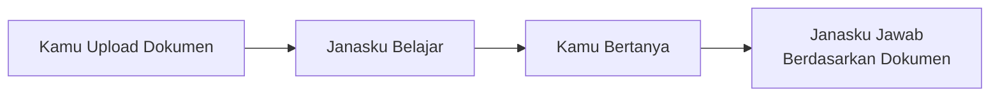
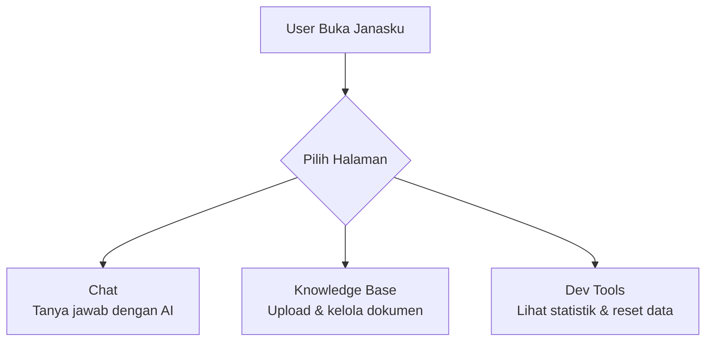
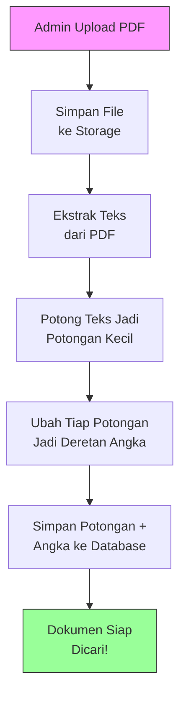
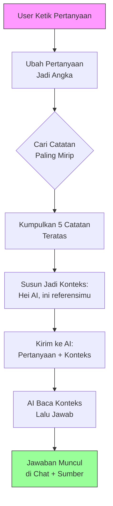
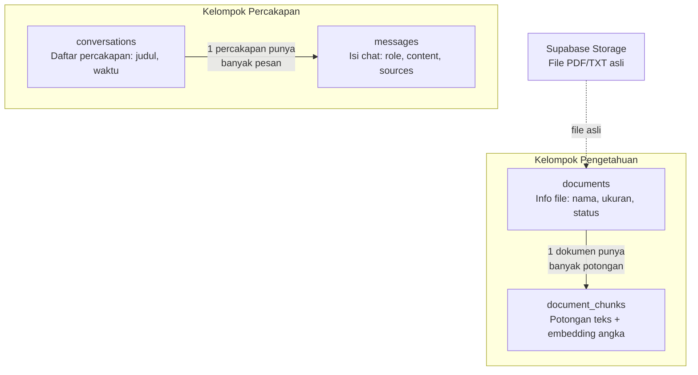

# Janasku — Panduan Super Mudah

> Dokumen ini adalah **pintu masuk pertama** kamu. Tidak ada kode di sini — murni konsep, analogi, dan diagram.
> Setelah paham gambaran besar, kamu bisa lanjut ke 5 dokumen detail di bawah.

---

## 1. Apa sih Janasku?

**Satu kalimat:** Janasku adalah chatbot pintar yang menjawab pertanyaan berdasarkan dokumen yang kamu upload.

Bayangkan kamu punya asisten yang bisa:
1. **Membaca** semua dokumen PDF yang kamu berikan
2. **Mengingat** isi dokumen tersebut
3. **Menjawab** pertanyaan kamu berdasarkan apa yang sudah dibaca

Ini berbeda dari ChatGPT biasa yang menjawab dari pengetahuan umum. Janasku menjawab dari **dokumen milik kamu**.



Teknik ini namanya **RAG** — *Retrieval-Augmented Generation*. Analoginya: ujian **open-book**. AI-nya boleh "buka catatan" sebelum menjawab, jadi jawabannya lebih akurat dan relevan.

---

## 2. Peta Aplikasi — 3 Halaman, 3 Tugas

Janasku punya 3 halaman utama. Masing-masing punya tugas spesifik:



| Halaman | Analogi | Yang Bisa Dilakukan |
|---------|---------|-------------------|
| **Chat** | Ruang konsultasi | Ketik pertanyaan, dapat jawaban + sumber dokumen |
| **Knowledge Base** | Perpustakaan | Upload PDF, lihat daftar dokumen, hapus dokumen |
| **Dev Tools** | Ruang admin | Cek statistik pemakaian, reset semua data |

Halaman **Chat** adalah yang paling sering dipakai user. **Knowledge Base** dipakai admin untuk "mengajari" Janasku. **Dev Tools** untuk keperluan development.

---

## 3. Alur Besar #1 — Mengajari Janasku (Ingestion)

Sebelum Janasku bisa menjawab, kita harus "mengajarinya" dulu. Caranya: upload dokumen PDF.

**Analoginya:** Bayangkan kamu seorang guru yang mau bikin catatan dari buku tebal:
1. Baca bukunya
2. Potong jadi catatan per topik
3. Beri label pada setiap catatan
4. Simpan rapi di lemari arsip

Itulah yang Janasku lakukan secara otomatis:



**Penjelasan tiap langkah:**

| Langkah | Analogi | Apa yang Terjadi |
|---------|---------|-----------------|
| **Upload PDF** | Serahkan buku ke guru | File disimpan di Supabase Storage |
| **Ekstrak Teks** | Guru baca bukunya | Teks diekstrak dari halaman PDF |
| **Potong Jadi Potongan** | Guru bikin catatan per topik | Teks dipecah jadi potongan ~500 kata (disebut **chunk**) |
| **Ubah Jadi Angka** | Guru beri kode pada catatan | Tiap potongan diubah jadi 768 angka oleh AI (disebut **embedding**) |
| **Simpan ke Database** | Catatan masuk lemari arsip | Potongan + angka disimpan di tabel `document_chunks` |

Kenapa diubah jadi angka? Karena komputer tidak bisa "memahami" teks, tapi bisa membandingkan angka. Angka-angka ini merepresentasikan **makna** dari teks — teks yang artinya mirip akan punya angka yang mirip juga.

---

## 4. Alur Besar #2 — Janasku Menjawab (Query)

Sekarang Janasku sudah punya "catatan". Saat user bertanya, inilah yang terjadi:

**Analoginya:** Siswa ujian open-book — baca catatan dulu yang relevan, baru tulis jawaban.



**Penjelasan tiap langkah:**

| Langkah | Analogi | Apa yang Terjadi |
|---------|---------|-----------------|
| **Ubah pertanyaan jadi angka** | Cari kode topik yang ditanya | Pertanyaan diubah jadi 768 angka (embedding) |
| **Cari catatan mirip** | Buka lemari, cari catatan topik sama | Bandingkan angka pertanyaan dengan angka semua potongan di database |
| **Kumpulkan 5 teratas** | Ambil 5 catatan paling relevan | Ini namanya **vector search** — cari yang angkanya paling mirip |
| **Susun konteks** | Tata catatan di meja sebelum jawab | Gabungkan 5 potongan jadi satu teks referensi |
| **Kirim ke AI** | Kasih soal + catatan ke siswa | Kirim ke Google Gemini: "Jawab pertanyaan ini berdasarkan konteks ini" |
| **AI jawab** | Siswa tulis jawaban | AI baca konteks, lalu jawab — jawabannya mengalir kata per kata (streaming) |

---

## 5. Di Balik Layar — Siapa Ngapain (Arsitektur)

Kode Janasku diorganisir dalam 3 layer + 2 layanan external:

```mermaid
flowchart TD
    subgraph External[Layanan External]
        Gemini[Google Gemini AI\nOtak untuk embedding & jawaban]
        Supa[Supabase\nDatabase + penyimpanan file]
    end

    subgraph App[Layer 1: Halaman]
        H1[/chat]
        H2[/knowledge-base]
        H3[/dev-tools]
        H4[/api/chat]
    end

    subgraph Features[Layer 2: Fitur]
        F1[Chat Feature\nLogika tanya-jawab]
        F2[Knowledge Base Feature\nLogika upload dokumen]
        F3[Dev Tools Feature\nLogika admin]
    end

    subgraph Shared[Layer 3: Shared Tools]
        S1[Supabase Client]
        S2[Gemini Client]
        S3[UI Components]
    end

    H1 --> F1
    H2 --> F2
    H3 --> F3
    H4 --> F1
    F1 --> S1
    F1 --> S2
    F2 --> S1
    F3 --> S1
    S1 --> Supa
    S2 --> Gemini
```

| Layer | Analogi Restoran | Isinya |
|-------|-----------------|--------|
| **Halaman** (`app/`) | Meja pelanggan | Apa yang user lihat dan klik |
| **Fitur** (`features/`) | Dapur | Logika bisnis — proses pesanan |
| **Shared** (`shared/`) | Gudang bahan & alat | Tools yang dipakai semua fitur |
| **Supabase** | Supplier bahan baku | Simpan data & file |
| **Gemini AI** | Chef spesialis | Proses embedding & generate jawaban |

**Aturan penting:** Halaman boleh panggil Fitur, Fitur boleh panggil Shared. Tapi Fitur **tidak boleh** panggil Fitur lain secara langsung. Ini menjaga kode tetap rapi dan tidak kusut.

---

## 6. Data Tinggal Dimana — 4 Tabel, 1 Storage

Semua data Janasku disimpan di Supabase. Ada 4 tabel utama yang terbagi jadi 2 kelompok:



| Tabel | Analogi | Menyimpan Apa |
|-------|---------|--------------|
| **documents** | Kartu katalog buku | Nama file, ukuran, status (uploading/ready/error) |
| **document_chunks** | Halaman-halaman buku | Potongan teks + 768 angka embedding |
| **conversations** | Topik pembicaraan | Judul chat, kapan dibuat |
| **messages** | Gelembung chat | Pesan user & AI, termasuk sumber dokumen |
| **Storage** | Rak buku fisik | File PDF/TXT yang asli |

Dua kelompok ini **tidak saling terhubung langsung** di database. Tapi secara logika, saat AI menjawab, ia mencari dari `document_chunks` dan hasilnya ditampilkan sebagai `sources` di `messages`.

---

## 7. Istilah-Istilah Kunci

| Istilah | Penjelasan Singkat |
|---------|-------------------|
| **RAG** | *Retrieval-Augmented Generation* — AI yang "buka catatan" dulu sebelum jawab |
| **Embedding** | Mengubah teks jadi deretan 768 angka yang merepresentasikan makna |
| **Vector** | Deretan angka itu sendiri — disebut vektor karena punya arah di ruang matematika |
| **Chunk** | Potongan kecil teks dari dokumen (~500 kata per potongan) |
| **Ingestion** | Proses "mengajari" sistem — upload, potong, embed, simpan |
| **Vector Search** | Mencari potongan yang angka-nya paling mirip dengan pertanyaan |
| **Streaming** | Jawaban muncul kata per kata (bukan tunggu selesai baru tampil) |
| **Supabase** | Layanan database + storage berbasis PostgreSQL |
| **pgvector** | Ekstensi PostgreSQL yang memungkinkan simpan & cari vektor |
| **Server Action** | Fungsi Next.js yang jalan di server, dipanggil langsung dari komponen |
| **API Route** | Endpoint HTTP di Next.js — dipakai untuk chat karena butuh streaming |
| **Gemini** | AI dari Google yang dipakai untuk embedding dan generate jawaban |

---

## 8. Mau Belajar Lebih Dalam?

Setelah paham gambaran besar di atas, kamu bisa lanjut ke dokumentasi detail. Baca sesuai urutan:

| # | File | Apa yang Kamu Pelajari |
|---|------|----------------------|
| 1 | [`essential_of_this_repository.md`](./essential_of_this_repository.md) | Tour lengkap repository — struktur folder, tech stack, file penting |
| 2 | [`essential_nextjs_concept.md`](./essential_nextjs_concept.md) | Konsep Next.js — routing, komponen, server actions |
| 3 | [`essential_supabase_concepts.md`](./essential_supabase_concepts.md) | Database Supabase — tabel, CRUD, storage, vector search |
| 4 | [`essential_rag_system.md`](./essential_rag_system.md) | Sistem RAG — ingestion pipeline, query pipeline, embedding |
| 5 | [`essentials_chatbot_back_and_forth.md`](./essentials_chatbot_back_and_forth.md) | Mekanika chatbot — streaming, komponen UI, state management |

**Tips:** Mulai dari file #1, lalu lanjut berurutan. Setiap file saling mereferensikan satu sama lain.

Selamat belajar!
