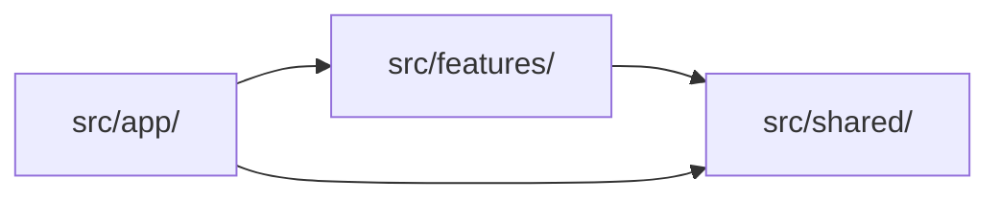

# Modular Feature-Based Architecture — High-Level Summary

## Three Layers

```
src/app/          → Routing layer (THIN — pages import from features, no business logic)
src/features/     → Business logic layer (THICK — where the real code lives)
src/shared/       → Foundation layer (domain-agnostic, reusable across all features)
```

## Dependency Rule



- `app/` → `features/` and `shared/`
- `features/` → `shared/` only
- `shared/` → external packages only
- Features NEVER import from other features

## Structure

```
src/
├── app/                                 # Next.js App Router — thin pages, layouts, route groups
│   ├── layout.tsx                       # Root layout
│   ├── page.tsx                         # Landing page
│   ├── (auth)/                          # Route group — centered layout
│   ├── (dashboard)/                     # Route group — sidebar layout
│   └── api/                             # API routes — delegate to features
│
├── features/{name}/
│   ├── index.ts                         # Barrel export — ONLY external entry point
│   ├── components/                      # React components for this feature
│   ├── hooks/                           # Hooks for this feature
│   ├── actions/                         # Server Actions ("use server")
│   ├── types.ts                         # Feature types
│   └── utils/                           # Feature utilities
│
└── shared/
    ├── components/ui/                   # UI primitives (shadcn)
    ├── components/layout/               # Layout shells
    ├── hooks/                           # Generic hooks
    ├── lib/                             # Utilities (cn, api-client, constants)
    ├── types/                           # Shared types
    └── providers/                       # React context providers
```

## Where Does Code Go?

1. **Route/page/layout?** → `src/app/`
2. **Specific to one feature?** → `src/features/{name}/`
3. **Used by 2+ features and domain-agnostic?** → `src/shared/`
4. **Not sure?** → Keep it in the feature. Extract later when a second consumer appears.

## Cross-Feature Communication

Features never import each other. The `app/` page acts as composition root — fetches data from multiple features and passes as props.

## Rules

| Rule | Detail |
|------|--------|
| Thin pages | `app/` pages under 30 lines — import feature component, render, done |
| Barrel exports | Import `@/features/chat`, never `@/features/chat/components/message-bubble` |
| No cross-feature imports | `app/` page fetches and passes data as props |
| Server by default | Add `"use client"` only when hooks, events, or browser APIs are needed |
| `shared/` is portable | "Could I copy `shared/` to another project?" If no → belongs in a feature |
| YAGNI structure | Don't create `hooks/`, `utils/` dirs until needed |
| kebab-case files | `message-bubble.tsx`, `use-chat.ts`, `send-message.ts` |
| Route groups for layouts | `(auth)/` centered, `(dashboard)/` sidebar, `(marketing)/` public |

## Import Paths

```ts
import { ChatInterface } from "@/features/chat";
import { Button } from "@/shared/components/ui/button";
import { cn } from "@/shared/lib/utils";
```

`@/*` maps to `src/`.
