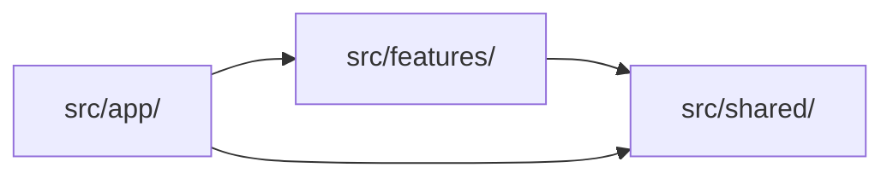

# Modular Feature-Based Architecture

## Why Not Technical Layering?

The common approach — organizing by `components/`, `hooks/`, `services/` at root — breaks down as the app grows:

- **Scattered related files**: A feature's component, hook, and service live in three different directories
- **Implicit dependencies**: Without boundaries, features silently couple to each other
- **Ownership confusion**: No clear team ownership when features cross-cut directories
- **Painful refactoring**: Changing one feature means touching files across the entire tree

Feature-driven architecture fixes this: **organize code by what it does, not what it is.**

## Three Layers

```
src/app/          → Routing layer (THIN — pages import from features, no business logic)
src/features/     → Business logic layer (THICK — where the real code lives)
src/shared/       → Foundation layer (domain-agnostic, reusable across all features)
```

## The One Rule

Dependencies flow downward only.



- `app/` imports from `features/` and `shared/`
- `features/` imports from `shared/` only
- `shared/` imports from nothing internal (only external packages)
- Features NEVER import from other features

## Structure

```
src/
├── app/
│   ├── layout.tsx                    # Root layout — providers, fonts
│   ├── page.tsx                      # Landing page
│   ├── globals.css
│   ├── (auth)/                       # Route group — centered layout
│   │   └── login/page.tsx            # Composes from features/auth
│   ├── (dashboard)/                  # Route group — sidebar layout
│   │   ├── layout.tsx
│   │   └── chat/page.tsx             # Composes from features/chat
│   └── api/                          # API routes (thin — delegate to features)
│
├── features/{name}/
│   ├── index.ts                      # Public API (barrel export — ONLY external entry point)
│   ├── components/                   # UI specific to this feature
│   ├── hooks/                        # Hooks specific to this feature
│   ├── actions/                      # Server Actions ("use server")
│   ├── types.ts                      # Feature types
│   └── utils/                        # Feature utilities
│
└── shared/
    ├── components/ui/                # UI primitives (button, input, modal — shadcn)
    ├── components/layout/            # Layout shells (sidebar, header)
    ├── hooks/                        # Generic hooks (use-debounce, use-local-storage)
    ├── lib/                          # Utilities (cn, api-client, constants)
    ├── types/                        # Shared type definitions
    └── providers/                    # React context providers
```

## Where Does Code Go?

1. **Route/page/layout?** → `src/app/`
2. **Specific to one feature?** → `src/features/{name}/`
3. **Used by 2+ features and domain-agnostic?** → `src/shared/`
4. **Not sure?** → Keep it in the feature. Extract later when a second consumer appears.

## Feature Example: Auth

```
src/features/auth/
├── index.ts                          # Public API
├── components/
│   ├── sign-in-form.tsx
│   └── sign-up-form.tsx
├── hooks/
│   └── use-auth.ts
├── actions/
│   └── auth.ts                       # Server Actions ("use server")
└── types.ts
```

**Barrel export — the only external entry point:**

```ts
// src/features/auth/index.ts
export { SignInForm } from "./components/sign-in-form";
export { SignUpForm } from "./components/sign-up-form";
export { useAuth } from "./hooks/use-auth";
export type { User, AuthCredentials } from "./types";
```

**Component using shared UI + local hooks:**

```tsx
// src/features/auth/components/sign-in-form.tsx
"use client";

import { Button } from "@/shared/components/ui/button";
import { useAuth } from "../hooks/use-auth";
import type { AuthCredentials } from "../types";

export function SignInForm() {
  const { signIn, isLoading } = useAuth();

  const handleSubmit = async (e: React.FormEvent<HTMLFormElement>) => {
    e.preventDefault();
    const formData = new FormData(e.currentTarget);
    await signIn({
      email: formData.get("email") as string,
      password: formData.get("password") as string,
    });
  };

  return (
    <form onSubmit={handleSubmit}>
      {/* form fields */}
      <Button type="submit" disabled={isLoading}>
        {isLoading ? "Signing in..." : "Sign In"}
      </Button>
    </form>
  );
}
```

**Thin page — under 30 lines:**

```tsx
// src/app/(auth)/login/page.tsx
import { SignInForm } from "@/features/auth";

export default function LoginPage() {
  return <SignInForm />;
}
```

## Cross-Feature Communication

Features never import from other features. When a feature needs data from another, the `app/` layer fetches it and passes as props:

```tsx
// src/app/(dashboard)/chat/page.tsx
import { ChatInterface } from "@/features/chat";
import { getSession } from "@/features/auth";

export default async function ChatPage() {
  const session = await getSession();
  return <ChatInterface user={session.user} />;
}
```

The `app/` page is the composition root — it wires features together without them knowing about each other.

## Rules

| Rule | Detail |
|------|--------|
| Thin pages | `app/` pages are under 30 lines — import feature component, render it, done |
| Barrel exports | External code imports `@/features/chat`, never `@/features/chat/components/message-bubble` |
| No cross-feature imports | If chat needs auth data, the `app/` page fetches it and passes as props |
| Server by default | Add `"use client"` only when hooks, events, or browser APIs are needed |
| `shared/` is portable | Test: "Could I copy `shared/` to a different project?" If no, it belongs in a feature |
| YAGNI structure | Don't create `hooks/`, `utils/` dirs until you need them |
| kebab-case files | `message-bubble.tsx`, `use-chat.ts`, `send-message.ts` |
| Route groups for layouts | `(auth)/` for centered, `(dashboard)/` for sidebar, `(marketing)/` for public |

## Principles

1. **Feature independence** — each feature is self-contained and can be understood in isolation
2. **Explicit dependencies** — barrel exports make every cross-boundary dependency visible
3. **Downward flow only** — app → features → shared, never sideways or upward
4. **Co-located code** — a feature's components, hooks, actions, and types live together
5. **Server by default** — only add `"use client"` when the browser is actually needed
6. **YAGNI structure** — don't create directories until you need them

## Import Paths

```ts
import { ChatInterface } from "@/features/chat";
import { Button } from "@/shared/components/ui/button";
import { cn } from "@/shared/lib/utils";
```

`@/*` maps to `src/`. No additional aliases needed.
